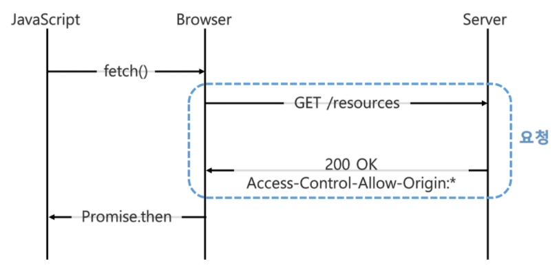

# CORS란?

> 참고 https://beomy.github.io/tech/browser/cors/ / https://developer.mozilla.org/ko/docs/Web/HTTP/CORS

cross-origin resource sharing

보통 CORS 오류를 많이 들어봤을 것이다. 이미 Vue를 학습하면서 정리했지만 매우 부실하다;;

면접에서 대답할수있을정도로 갖춰야되서 정리를 하려고한다.


CORS란 브라우저에서 다른 출처의 리소스를 공유하는방법입니다.


URL 구조를 살펴보면 이렇습니다.

프로토콜의 HTTP는 80번, HTTPS는 443 포트를 사용합니다.


여기에서 말하는 출처란 URL 에서 프로토콜,호스트,포트를 합친것입니다.

이는 콘솔창에서  `location.origin`를 실행하면 출처를 확인 가능합니다.


동일출처정책이란게 있습니다.

다른 출처의 리소스 접근을 금지하는 정책입니다. 근데 다른 출처의 리소스는 자주 쓰이지 않는가.?라는 의문이 듭니다. API 서버로 데이터 요청하는것이 다른출처에서 리소스 접근하는 것이기떄문입니다.

하지만 필요한 정책입니다.

XSS 나 XSRF 등의 보안 취점을 방어할수있는 정책입니다. 그래서 외부리소스를 사용하기위한 동일출처정책의 예외가 CORS 입니다.

XSS: 권한없는 사용자가 웹 사이트에 스크립트를 삽입하는 공격 기법

XSRF: 쿠키만으로 인증하는 서비스의 취약점을 이용해, 사용자가 모르게 해당 서비스에 특정 명령을 요청하는 공격


그럼 어떻게 동작할까요

두가지가 있는데 단순요청방법과 예비요청을 보내는 방법이 있습니다.


### 단순요청방법

서버에게 바로 요청을 보내는 겁니다.




조건

- 요청메서드는 GET, HEAD, POST 중 하나여야한다.
- Accept, Accept-Language, Content-Language, Content-Type, DPR, Downlink, Save-Data, Viewport-Width, Width를 제외한 헤더를 사용하면 안 됩니다.

- Content-Type 헤더는 application/x-www-form-urlencoded, multipart/form-data, text/plain 중 하나를 사용해야 합니다.

2번 조건은 사용자 인증에 사용되는 `Authorization` 헤더도 포함되지 않아 까다로운 조건이며, 3번 조건은 많은 REST API들이 `Content-Type`으로 `application/json`을 사용하기 때문에 지켜지기 어려운 조건입니다.


### 예비요청을 보내는 방법


예비요청방법은 총2번의 요청을 보냅니다.


예비 요청방법은 실제 리소스를 요청하기 전에 `OPTIONS`라는 메서드를 통해 실제 요청을 전송할지 판단합니다.

`OPTIONS` 메서드로 서버에 예비 요청을 먼저 보내고, 서버는 이 예비 요청에 대한 응답으로 `Access-Control-Allow-Origin` 헤더를 포함한 응답을 브라우저에 보냅니다. 브라우저는 단순 요청과 동일하게 `Access-Control-Allow-Origin` 헤더를 확인해서 CORS 동작을 수행할지 판단합니다.


결국 CORS 에러를 고치기위해서는 서버에 `Access-Control-Allow-Origin` 헤더가 포함되게 해달라고 요청해야된다는 것입니다.


Node.js의 Express는 cors 라는 서드파트미들웨어를 지원하기 떄문에 라이브러리에서 알아서 CORS 응답헤더를 추가해줍니다.


```
Access-Control-Allow-Origin: chrome://new-tab-page
```

이런식으로 하나의 리소스에 대해서

```
Access-Control-Allow-Origin: *
```

이렇게하면 브라우저는 출처에 상관없이 모든 리소스에 접근할수있습니다.


요청 헤더 목록에는 다음과 같이 있습니다.

- Origin
- Access-Control-Request-Method
  - `preflight`요청을 할 때 실제 요청에서 어떤 메서드를 사용할 것인지 서버에게 알리기 위해 사용됩니다.
- Access-Control-Request-Headers
  - `preflight`요청을 할 때 실제 요청에서 어떤 header를 사용할 것인지 서버에게 알리기 위해 사용됩니다.

응답 헤더들은 다음과 같이 있습니다.

- Access-Control-Allow-Origin
  - 브라우저가 해당 origin이 자원에 접근할 수 있도록 허용합니다. 혹은 `*`은 credentials이 없는 요청에 한해서 모든 origin에서 접근이 가능하도록 허용합니다.
- Access-Control-Expose-Headers
  - 브라우저가 액세스할 수있는 서버 화이트리스트 헤더를 허용합니다.
- Access-Control-Max-Age
  - 얼마나 오랫동안 `preflight`요청이 캐싱 될 수 있는지를 나타낸다.
- Access-Control-Allow-Credentials
  - `Credentials`가 true 일 때 요청에 대한 응답이 노출될 수 있는지를 나타냅니다.
  - `preflight`요청에 대한 응답의 일부로 사용되는 경우 실제 자격 증명을 사용하여 실제 요청을 수행 할 수 있는지를 나타냅니다.
  - 간단한 GET 요청은 `preflight`되지 않으므로 자격 증명이 있는 리소스를 요청하면 헤더가 리소스와 함께 반환되지 않으면 브라우저에서 응답을 무시하고 웹 콘텐츠로 반환하지 않습니다.
- Access-Control-Allow-Methods
  - preflight`요청에 대한 대한 응답으로 허용되는 메서드들을 나타냅니다.
- Access-Control-Allow-Headers
  - `preflight`요청에 대한 대한 응답으로 실제 요청 시 사용할 수 있는 HTTP 헤더를 나타냅니다.


# 기타 해결 방법

서버에서 응답 헤더들을 추가하는 방법 이외의 CORS를 우회하는 방법을 이야기해보도록 하겠습니다.

## JSONP

JSONP(JSON with Padding)는 `<script>` 요소가 외부 출처 리소스를 가져올 수 있는 특징을 사용하는 방법입니다. 아래 코드와 같은 방법으로 사용할 수 있습니다.

```
<!-- Frontend -->
<!DOCTYPE html>
<html>
  <script>
    function jsonpFn (data) {
      console.log(data) // beomy
    }
  </script>
  <script
    type="application/javascript"
    src="http://localhost:3001/cors?callback=jsonpFn"
  >
  </script>
</html>
// Backend
router.get('/cors', (req, res, next) => {
  res.send(`${req.query.callback}('beomy')`)
})
```

## 프록시 서버

프론트엔드와 백엔드 사이에 프록시 서버를 두는 방법으로 CORS를 해결할 수도 있습니다. 개발 환경에서 CORS를 해결해야 한다면, Webpack Dev Server 등의 라이브러리를 사용해서 프록시 설정을 하는 방법도 있습니다.


## 효과

- 악의적인 사이트 배제

- 응답에 대한 검증

- 서버는 응답하되 부라우저에서 차단가능

- 리소스 접근에 대한 관리가능


## Example

Vue.js 에서 서버로 요청하고 서버는 응답에 + CORS 헤더를 붙여서 클라이언트 브라우저에 전송

브라우저는 확인하고 허용여부를 결정한다.

뷰는 8080 장고는 8000

뷰에서 데이터를 요청하고 장고에서 응답이 오지만 응답헤더를 보고선 차단한다.


django-cors-headers

https://github.com/adamchainz/django-cors-headers

