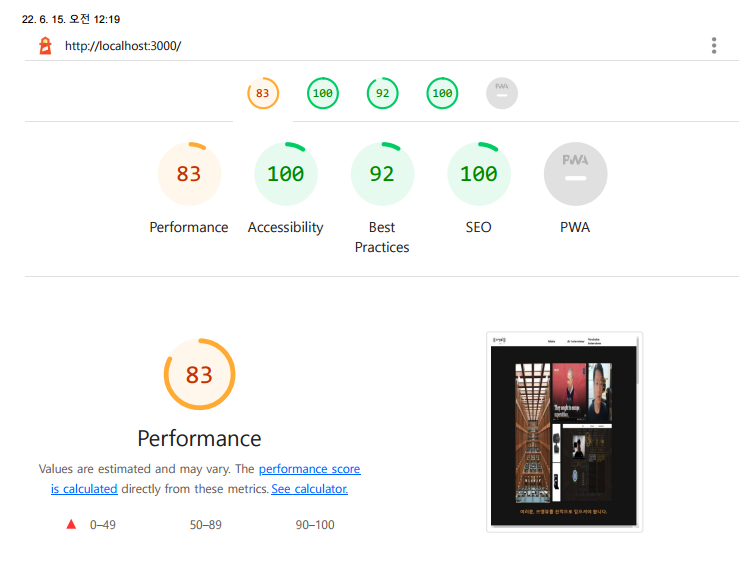
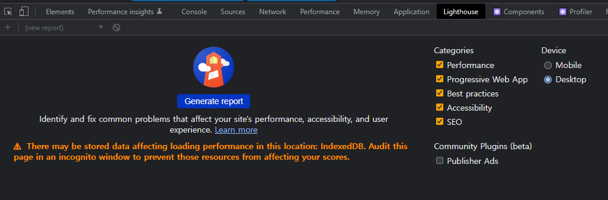
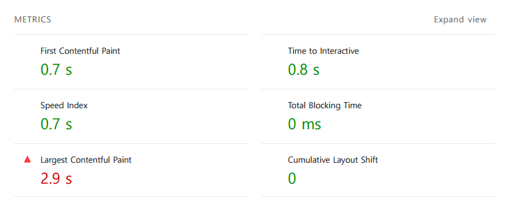
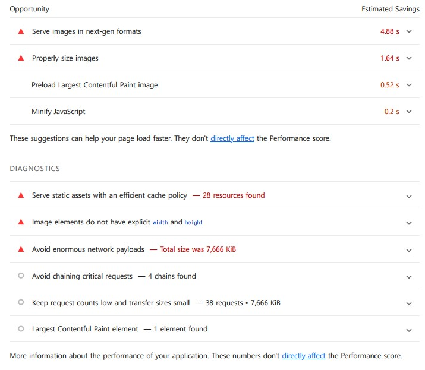

## 프로젝트, 웹 서비스 성능 체크하기 : **Ligth house**

###  

### **0. 성능 체크의 중요성**

프로젝트를 진행하면서 개발하고 배포를 하면 끝! 이 아니라 시작입니다. 

좀 더 견고한 서비스가 되어야 하고 지속적으로 사용자 경험을 생각하면서 끊임없이 개선해야 합니다.

그래서 서비스의 성능을 체크하는 방법 중 하나인 **Lighthouse**에 대해서 소개드리고자 합니다.

Lighthouse

### **1. Ligthhouse란**

웹페이지 품질을 측정하기 위한 자동화된 오픈 소스 도구입니다. 크롬에서 개발자 도구를 통해서 손쉽게 웹페이지 품질 체크가 가능합니다.

웹페이지 품질은 **P****erformance**, **Accessibility**, **Best Practices**, **SEO** 등등 여러 가지 요소들을 체크하여 점수로 나타내 줍니다.

이렇게 점수로 평가를 해줌

각 요소들이 뜻하는 것은 이렇습니다.

- **Performance** : 웹페이지 로딩 속도 (실제 성능) 
- **Accessibility** : 접근성 ( 폰트 사이즈, 메뉴 간격)
- **Best Practices** : Best Practices에 맞게 개발되었는지
- **SEO** : 검색엔진 최적화
- **PWA** : 웹과 네이티브 앱의 기능 모두 이점이 있는지

### **2. 사용방법**

Lighthouse 사용

F12를 통해서 개발자 도구에 들어가면 탭에서 **Ligthhouse**를 확인할 수 있으며

  Geneate report 를 통해서 품질 측정이 가능합니다.

- **Catesgories** : 확인하고자 하는 성능을 선택적으로 체크가 가능합니다.

- **Device**

  : 모바일 환경과 데스크톱 환경으로 나눌 수 있습니다.

  - 데스크톱이 모바일보다 성능이 높기 때문에 지표는 모바일 환경이 더 낮게 나옵니다.

품질 측정을 진행하면 대표적인 성능 체크 요소뿐만 아니라 다른 요소들도 보여줍니다.

- **FCP:** 첫 번째 텍스트 또는 이미지가 표시되는 시간
- **Time to Interactive :** 완전히 페이지와 인터렉션 할 수 있게 될 때까지 걸리는 시간
- **Speed Index :** 페이지 콘텐츠가 얼마나 빨리 표시되는지
- **Total Blocking Time :** FCP ~ Time to interactive 사이에 모든 시간의 합
- **LCP :** 최대 텍스트 또는 이미지가 표시되는 시간
- **Comulative Layout Shift :** 시각적 안정성의 

또한 웹서비스에서 개선할 요소를 제시해주며 해결방법도 제시해주는 것이 **Ligthhouse**의 장점이라고 생각합니다.

개선할 수 있는 요소들

### **3. 마무리**

**Ligthhouse**는 너무나 간단하게 웹사이트의 성능을 체크할 수 있습니다. 또한 수치를 통해서 성능개선이 눈에 보인다는 점이 매우 보람차게 느낄 거 같습니다.

문제점을 파악해보면서 Performance, Accessibility, Best Practices, SEO 지표를 모두 100점으로 만들어 보면서 웹서비스의 성능개선해보면 좋을 것 같습니다.

------

더 자세한 설명을 원하시면 밑에 공식적인 링크가 있으니 확인하시면 좋습니다.

https://developer.chrome.com/docs/lighthouse/overview/ 

[
Overview - Chrome DevelopersLearn how to set up Lighthouse to audit your web apps.developer.chrome.com](https://developer.chrome.com/docs/lighthouse/overview/)