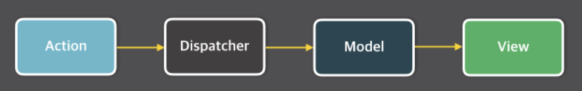
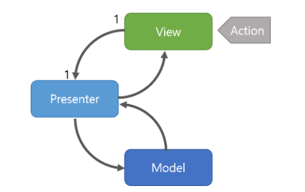
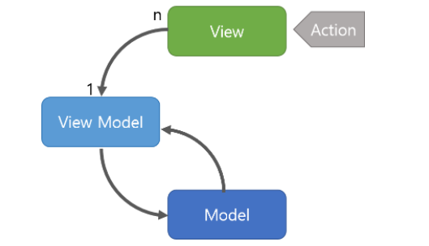

# 디자인 패턴

- 객체 지향 프로그래밍이란?

  프로그래밍의 한 기법으로 필요한 데이터와 동작을 객체롤 만들어서 구현하는 기법입니다.

  클래스와 객체를 기반으로, 추상화,캡슐화, 상속, 다형성 등의 기법을 사용해서 프로그래밍합니다.

  핵심은 객체에 초점을 두어 "관심사 분리"가 이뤄진다는 것입니다. 이를 통해서 프로그램이 한층 단순화되고 개발과 유지 보수에 용이해 집니다.

- 재귀 함수란

  자신을 정의할때 자기 자신을 재참조하는 방법을 말합니다.

  알고리즘 구현에있어서 식이 간단하다는 장점이있으나, 재귀의 호출 횟수가 많아질수록 함수 순서를 저장하는 콜스택이 넘치는 Stack overflow 현상이 일어나기떄문에 주의해서 써야합니다. 

- 디자인 패턴이란
  - 프로그램을 개발하면서 생긴 문제들을 정리하여 상황에 맞게 적용해서 처리할 수 있도록 정리하여 특정한 '규약'을 통해 쉽게 쓸 수 있는 형태로 만든것

- 디자인 패턴 사용의 이유

  디자인 패턴에는 MVC 패턴 MVVM 패턴등 다양하게 존재합니다.

  이들의 핵심은 '관심사분리'라고 생각합니다. 데이터와 로직에 관해서 초점을 어떻게 잡는냐에 따라 구현방향이 달라지고 흐름이 명확해지기 때문에 디자인패턴을 사용합니다.

- 모놀리틱 아키텍쳐와 마이크로서비스 아키텍쳐의 차이

  모놀리틱 아키텍쳐는 하나의 어플리케이션에 모든 로직이 들어가있으며

  마이크로 서비스 아키텍쳐의 경우 작은 단위의 서비스들이 모여 하나의 시스템을 제공합니다.

  모놀리틱의 경우 규모가 작은경우 설계,배포,운영이 쉽지만 규모가 커지면 구동시간이 오래걸릴뿐더러 하나의 오류로 모든 시스템에서 문제가 생길수있습니다.

  하지만 마이크로서비스의 경우 서비스마다 느슨하게 연결되어있기때문에 독립적으로 서비스가 운영됩니다.

  단점은 서비스간에 연결을 위해서 통신을 만들고 latency 같은 요소를 고려해야된다는 점입니다.

- 프레임워크와 라이브러리의 차이

  흐름의 차이라고 말할수있겠습니다. 프레임워크의 경우 작성된코드를 호출한다면 라이브러리는 작성된 코드에서 호출하는 차이를 갖고있습니다.

- 워터폴 방법론과 애자일 방법론의 차이

  워터폴의 경우 탑다운 방식으로 예측가능한 결과물을 예측 가능한 시간에 만들어내는 에 초점이 잡힙니다.

  애자일의 경우 워터폴방식을 반복하는 식으로 스프린트라는 일정기간을 두어 결과물을 만들어가며 지속인 발전에 초점을 잡습니다.

## MVC 패턴

- 어플리케이션을 세개의 영역으로 나누어 각 요소에게 고유한 역할을 부여하는 개발 방식입니다.
  - 이를 통해서 비즈니스 로직과 UI영역이 분리가되어 서로 영향을 주지않고 유지보수가 가능합니다.
  - 유지보수의 편리성을 위해서 사용합니다.
    - 유지보수를 진행하면서 각 기능간의 결합도가 높아지고 이는 비즈니스 로직에 영향을 끼칩니다.
- model, view, controller
  - 모델 : 데이터와 비즈니스 로직을 관리합니다.
  - 뷰 : 레이아웃과 화면을 처리합니다.
  - 컨트롤러 : 명령을 모델과 뷰부분으로 라우팅합니다.

- Django에서는 이를 MVC 라고 하지않고 MTV 패턴이라고 합니다.
- 한계
  - 대규모 프로그램의 경우 한 컨트롤러에 연결된 모델과 뷰가 과도하게 커지는 경우 그렇습니다.
  - 뷰와 모델이 양방향으로 영향을 끼치기 때문에 서로 의존성이 커지며 이는 유지보수의 어려움으로 향합니다.
    - 한 변경이 비동기적으로 일어날수있고 다수의 변경을 일으킨다.
    - 예를 들어 페이스북의 메세지 알림의 버그가 이로인한 에러라고 규정했습니다.
  - 이를 해결하기위해서
    - MVVM 
    - flux
    - MVP  등 다양한 패턴이 생겨났습니다.

## flux 패턴

- 기존 MVC 패턴의 양방향 데이터 흐름을 벗어나 단방향 데이터흐름으로 만든 패턴입니다.

  

- Action / Action Creator
  - 액션은 데이터의 상태를 변경할 수 있는 명령어 카드와 같습니다. 
  - 액션 생성자는 새로 발생한 액션의 타입과 데이터 페이로드를 액션 메시지로 묶어 디스패쳐로 전달합니다.
- Dispatcher
  - 디스패쳐는 액션 메시지를 감지하는 순간 그것을 각 스토어에 전달합니다. 전달은 콜백 함수로 이루어지며, 등록되어 있는 모든 스토어로 페이로드를 전달할 수 있습니다. 이때 스토어가 서로를 의존하고 있다면 (학생의 개인정보를 담은 스토어와 모든 학생의 수학 점수만을 담은 스토어를 예로 들 수 있겠군요) 특정 스토어가 업데이트되기를 기다리게 해주는 `waitFor()`를 사용할 수 있습니다.
- Store (Model)
  - 스토어는 어플리케이션의 상태와, 상태를 변경할 수 있는 메서드를 가지고 있습니다. 어떤 타입의 액션이 날아왔느냐에 따라 메서드를 다르게 적용해 상태를 변경하게 됩니다.
- View
  - React에 해당되는 부분입니다. 컨트롤러 뷰는 스토어에서 변경된 데이터를 가져와 모든 자식 뷰에게 데이터를 분배합니다. 데이터를 넘겨받은 뷰는 화면을 새로 렌더링합니다.

## mvp 패턴

- model, view, presenter

  - Model : 어플리케이션에서 사용되는 데이터와 그 데이터를 처리하는 부분입니다.
  - View : 사용자에서 보여지는 UI 부분입니다.
  - Presenter : View에서 요청한 정보로 Model을 가공하여 View에 전달해 주는 부분입니다. View와 Model을 붙여주는 접착제..? 역할을 합니다.

- 동작 방식

  1. 사용자의 Action들은 View를 통해 들어오게 됩니다.

  2. View는 데이터를 Presenter에 요청합니다.

  3. Presenter는 Model에게 데이터를 요청합니다.

  4. Model은 Presenter에서 요청받은 데이터를 응답합니다.

  5. Presenter는 View에게 데이터를 응답합니다.

  6. View는 Presenter가 응답한 데이터를 이용하여 화면을 나타냅니다.

- 특징

  - presenter를 통해서 데이터를 전달 받기 때문에 view 와 model의 의존성이 없다는 장점이 있습니다.
  - 하지만 view 와 presenter의 의존성이 강해지는 단점이 있습니다.

## MVVM 패턴

- Model + View + View Model

  - Model : 어플리케이션에서 사용되는 데이터와 그 데이터를 처리하는 부분입니다.
  - View : 사용자에서 보여지는 UI 부분입니다.
  - View Model : View를 표현하기 위해 만든 View를 위한 Model입니다. View를 나타내 주기 위한 Model이자 View를 나타내기 위한 데이터 처리를 하는 부분입니다.

- 동작

  1. 사용자의 Action들은 View를 통해 들어오게 됩니다.

  2. View에 Action이 들어오면, Command 패턴으로 View Model에 Action을 전달합니다.

  3. View Model은 Model에게 데이터를 요청합니다.

  4. Model은 View Model에게 요청받은 데이터를 응답합니다.

  5. View Model은 응답 받은 데이터를 가공하여 저장합니다.

  6. View는 View Model과 Data Binding하여 화면을 나타냅니다.

- 특징
  - Command 패턴과 Data Binding을 통해서 View와 ViewModel의 의존성을 없앴습니다.
  - view model의 설계가 쉽지 않습니다.
  - MVC에서는 유저 상호작용이 일어났음을 View -> Controller로 알리고 그에 따라 어떤 행동을 할지는 모두 Controller가 정했다면, MVVM의 ViewModel은 로직만 가지고 있고, 어떤 행동을 할지는 View가 정한다.

- **커맨드 패턴**(Command pattern)이란 요청을 객체의 형태로 [캡슐화](https://ko.wikipedia.org/wiki/캡슐화)하여 사용자가 보낸 요청을 나중에 이용할 수 있도록 매서드 이름, 매개변수 등 요청에 필요한 정보를 저장 또는 로깅, 취소할 수 있게 하는 패턴이다.

----

- flux의 이해 : https://bestalign.github.io/translation/cartoon-guide-to-flux/

- MVP, MVVM : https://beomy.tistory.com/43

- 커맨드 패턴 : https://ko.wikipedia.org/wiki/%EC%BB%A4%EB%A7%A8%EB%93%9C_%ED%8C%A8%ED%84%B4

- MVVM 사용방식 : https://medium.com/hcleedev/ios-swiftui%EC%9D%98-mvvm-%ED%8C%A8%ED%84%B4%EA%B3%BC-mvc%EC%99%80%EC%9D%98-%EB%B9%84%EA%B5%90-8662c96353cc

