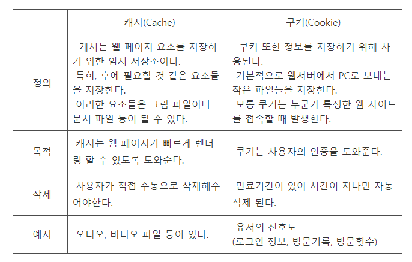

# 브라우저 저장소

웹사이트의 데이터를 저장하는곳으로

영구적으로 저장되는 로컬스토리지와

임시로 저장되는 세션 스토리지로 구분이된 환경으로 구성된다.

### 웹스토리지

데이터가 클라이언트에 있을뿐 서버전송이없다. 그래서 네트워크 트래픽의 비용을 줄여준다.

구조화된 객체를 저장할수있다. 단 브라우저의 지원여를 확인

용량의 제한이없다.

영구데이터 저장이 가능하다.

데이터 지속성에 따라서 로컬, 세션 스토리지로 나눠지는데

로컬 스토리지

- 키,벨류 스트링 타입으로 저장하는 기능만있음

- 데이터를 영구적으로 보관이 가능하다

- 도메인마다 생성된다.

- 도메인만 같으면 전역으로 공유가능하다.
- 자동로그인에 사용됨

세션스토리지

- 접속중인 웹서버에 저장됨 

- 지속적으로 보관이 되지않는다.
- 현제 브라우징되고있는 내에서만 데이터 유지된다.
- 즉 브라우저 종료면 데이터도 지워진다.
- 주로 보안이 중요한 로그인정보를 유지하는 사용한다.
- 쿠키에 비해 보안이좋음

### 쿠키

웹사이트에 의해 유저의 정보를 저장하는것

- 서버에 저장이 되지않고 브라우저에 저장이된다 -> 서버자원을 쓰지않는다.
- 브라우저가 종료되도 쿠키시간이 안지나면 삭제가 안된다. -> 브라우저 종료되어서 정보유지가 가능하다.
- 팝업창,비로그인 장바구니, 입력폼정보저장에 쓰인다.

- 매번HTTP마다 서버로 전송된다.
  - 웹사이트에서 쿠키를 설정하면 모든 웹요청은 쿠키정보를 포함해서 서버로 전송된다.
- 제한적인 용량
- 보안문제 해결
  - HttpOnly 속성을 적용하면 자바스크립트로 접근이 불가능 하기 때문에 XSS(Cross-Site-Scripting)을 방지할 수 있다. 
  - 하지만 여전히 전달과정에서 도난당할 수 있으므로 CSRF(Cross-Site-Request-Forgery)에 취약하다. 
  - 이러한 점을 방지하기 위해 API에 대한 요청을 특정 함수를 통해서만 이루어지도록 한다던가(토큰에 특정 해쉬값을 추가하여 발송) 
  - HTTP헤더의 Referer, origin값을 분석하여 막는 방법이 있다.

쿠키와 vs 스토리지

쿠키는 대부분 브라우저에서 지원하는것

HTTP 요청마다 암호화없이 전달되기떄문에 위험

스토리지는 부라우저나 디바이스 환경을 많이탄다.

HTTP요청마다 서버에 전달되지않음 데이터를 클라이언트에만 전송할뿐임/ 자원낭비 적음

문자열 이외에 객체도 저장 가능

CSRF에도 보안상 안전하지만 

 자바스크립트로 제어할 수 있기 때문에 XSS에 취약하다.

### 캐시

<쿠키하고 비슷하지만 목적성이 다름>

리소스파일의 임시저장소

같은 웹페이지에 접속할때 사용자의 PC에서 로드해서 서버를 거치지 않는다.

이전에 사용할 데이터를 거의 씀 => 그래서 페이지 로딩이 빠름

