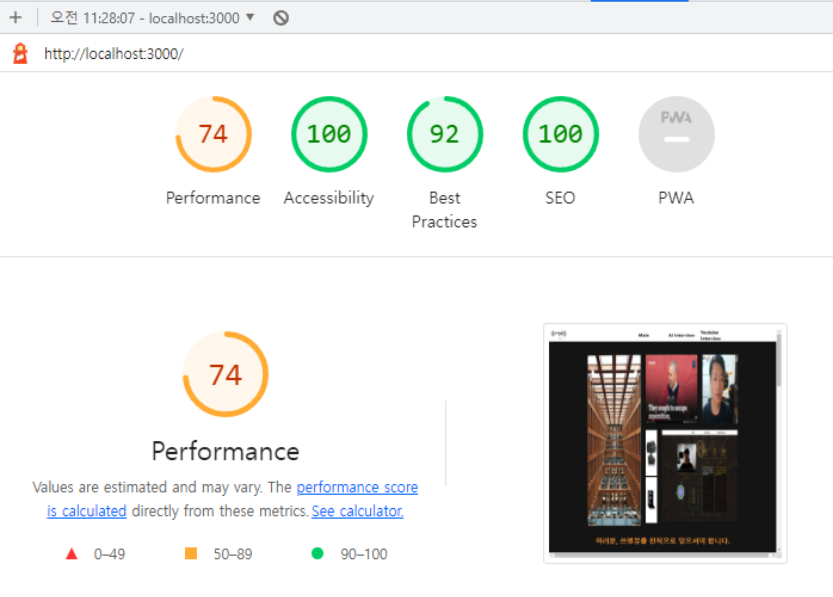

## 웹페이지 성능 체크

### 1. [Chrome lighthouse][https://developers.google.com/web/tools/lighthouse]

> Chrome 브라우저 내 개발자도구에 내장된 퍼모먼스 측정 도구

- Performace :  웹 페이지의 로딩 속도 등 실제 성능을 측정합니다.
- Accessibility: 접근성입니다. 보통 폰트 사이즈, 메뉴간 간격 등을 측정합니다.
- Best practices: Best practices를 따라 개발되었는지 체크합니다.
- Progressive Web App: PWA로 부르며, 웹과 네이티브 앱의 기능 모두의 이점을 가지도록 만들어진 서비스인지 체크합니다.
- SEO: Search Engine Optimization의 약자로 검색 엔진 수집 최적화에 관련된 부분입니다. 여긴 아마 웹 사이트 운영하시면 많이 민감하게 신경쓰시는 부분이죠.

### 2. 웹팩 번들 애널라이저

- 번들의 크기를 파악하기 위해서 사용
  - 이를 통해서 큰 크기의 번들같은 경우 코드 스플리팅을 통해서 초기 로딩속도 감소를 요할 수 있음
    - react.lazy()
    - 여러 번들로 나눔으로서 병렬로 로드할 수 있음

- cra를 사용한 프로젝트는 종속된 라이브러리 전부를 보여주지 않기때문에 기존방식과 다름
  - [진행한 방식][https://velog.io/@code-bebop/eject-%EC%97%86%EC%9D%B4-CRA%EC%9D%98-webpack.config-%EC%88%98%EC%A0%95%ED%95%98%EA%B8%B0]

### 3. 네트워크 확인(FCP, LCP)

- FCP : 첫요소가 로드 될때의 걸리는시간
- LCP : 주요컨텐츠가 로드 될때 까지 걸리는 시간

#### **Web vitals**

> 사용 경험에 영향을 미치는 다양한 측정 가능한 값들 중에서 구글이 중요하다 강조하는 3가지 

- LCP : 사용자가 URL을 요청한 시점부터 표시 영역에 가장 큰 시각 콘텐츠 요소를 렌더링하는 데 걸린 시간
  - 주요 컨텐츠 로드 시간
- FID : 사용자가 페이지와 처음 상호작용했을 때부터(링크를 클릭하거나, 버튼을 탭하는 경우 등) 브라우저가 상호작용에 반응할 때까지의 시간
  - 이벤트 작동 이후 동작 시간
- CLS : 페이지의 전체 수명 동안 발생하는 모든 예상치 못한 레이아웃 변화의 모든 개별적인 레이아웃 변화 점수의 총 합계
  - 레이아웃 변경정도

|      |      좋음      |   개선 필요    |      느림      |
| :--- | :------------: | :------------: | :------------: |
| LCP  |   2.5초 이하   |    4초 이하    |    4초 초과    |
| FID  | 100밀리초 이하 | 300밀리초 이하 | 300밀리초 초과 |
| CLS  |    0.1 이하    |   0.25 이하    |   0.25 초과    |

### 4. SEO

 구글은 아래의 5가지를 웹 페이지 경험에 영향을 크게 미치는 요소라고 이야기했다. 많은 SEO 전문가들은 이들 항목에서도 좋은 평가를 받아야 랭킹에서도 좋은 결과를 얻을 수 있다고 전망하고 있다.

- 모바일 친화성: 웹 페이지가 모바일 브라우징에 최적화 되어 있는 가에 대한 평가
- 세이프 브라우징: 페이지에 방문자의 의도를 속이려는 의도를 가진 좋게 말해서 오해의 여지가 있는 콘텐츠가 있는가? 혹은 악성 코드나 애드 웨어 등이 심겨져 있지 않은 가에 대한 평가
- HTTPS: 당신의 웹 사이트가 HTTPS를 제공하고 있는 가에 대한 평가
- 방해요소: 콘텐츠 소비를 방해하는 전면 광고와 같은 방해 요소가 있는 가에 대한 평가

- desktop 환경에서 no throttle로 0.2s
- 크롤러는 자바스크립트를 해석하는데 한정된 시간을 가지며 클라이언트 사이드 렌더링 이에 불리한 위치를 가짐
- ssr with hydration 이는 html을 만들어서 보내줌

### 5. SonarQube

정적 분적 애플리케이션

###  

### 6. DB replication

두 개의 이상의 DBMS 시스템을 `Mater / Slave`로 나눠서 동일한 데이터를 저장하는 방식

- 사용자는 점점 많아지고 Database는 많은 Query를 처리하기엔 너무 힘든 상황이 생김
- `Master DBMS`에는 데이터의 수정사항을 반영만하고 Replication을 하여 `Slave DBMS`에 실제 데이터를 복사

장점

- Query의 대부분은 `Select`가 차지하고 있다.
  - 이 부분의 부하를 낮추기 위해 많은 `Slave Database`를 생성하게 된다면 
  - `Read(Select)` 성능 향상 효과를 얻을 수 있다.

- `Master Database` 영향없이 로그를 분석할 수 있다.

### 7. 2차 캐싱

엔티티를 캐싱하는 2차캐싱

#### 이외에 점검 툴

- react profiler
- 제니퍼 프론트
- 뉴렐릭

