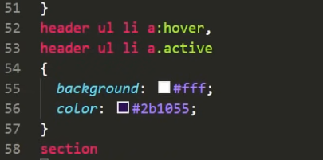
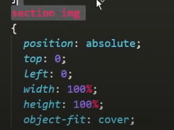
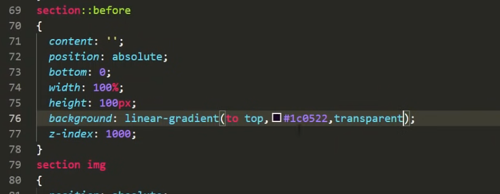
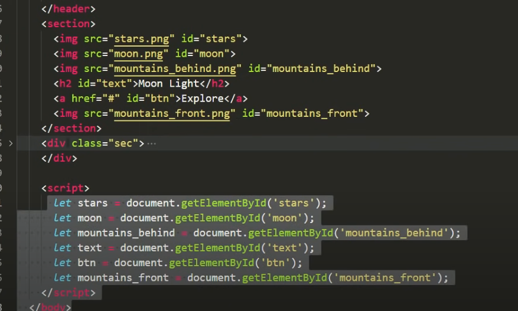
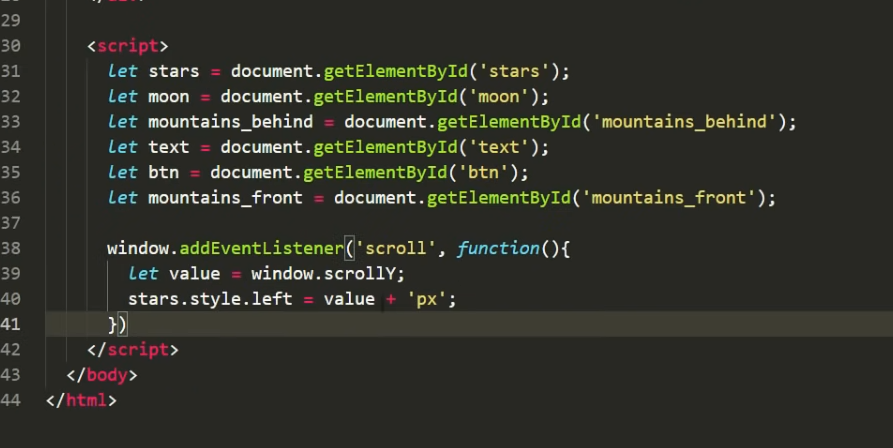

# CSS 적용

페이지 구현하는 유투브

https://www.youtube.com/watch?v=1wfeqDyMUx4

이렇게하면 해당 버튼에 호버를 하면 색칠이되고, active 가됨

모든이미지가 통째로 한곳에 모이게됨

물론 section 은 relative임

경계를 없애줌

진짜~~~~~ ~~~간단함!!! 

스크롤에 따른 이동 구현하기

