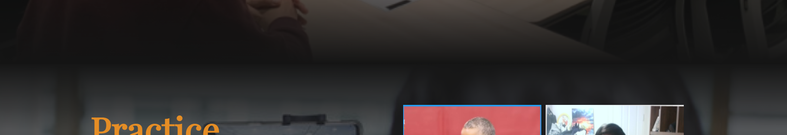

# 그라데이션

CSS를 통해서 그라데이션은 알고는 있었다.

쓸일이 있을까 의아했는데 쓸일이 오고야 말앗다.


 코딩 방법은 어렵지않다.

```
linear-gradient( direction, color1, color2, …, color3 )
```

이런식이라 `direction` 방향으로 color1부터 순차적으로 그라데이션이 생긴다.


```css
background-image: linear-gradient(
    rgba(20, 20, 20, 1) 0%,
    rgba(20, 20, 20, 0.4) 10%,
    rgba(20, 20, 20, 0) 15%,
    rgba(20, 20, 20, 0) 85%,
    rgba(20, 20, 20, 0.4) 90%,
    rgba(20, 20, 20, 1) 100%
  ),url('../../image/Page3_back.png');
```

직접 사용한 코드는 이렇다.


해석하자면 

0%~ 10%는 `rgba(20, 20, 20, 1)`

10%~15%는 `rgba(20, 20, 20, 0.4)`

이런식으로 색깔을 줌으로써 그라데이션을 스무스~ 하게 바꾸었다.

그리고 위아래 양쪽으로 음영이 퍼지게 해야했기 때문에 중간을 기점으로 rgba값이 대칭을 이룬다. 




이런식으로 사진의 경계를 지울수있다.


direction 은

- to bottom : 위에서 아래로 그라데이션을 만듭니다. (기본값)
- to top : 아래에서 위로 그라데이션을 만듭니다.
- to left : 오른쪽에서 왼쪽으로 그라데이션을 만듭니다.
- to right : 왼쪽에서 오른쪽으로 그라데이션을 만듭니다.
- ndeg : n도의 방향으로 그라데이션을 만듭니다.

이걸로 설정 가능하다.


찾아보니

`repeating-linear-gradient` 이걸로 반복도 가능하다!