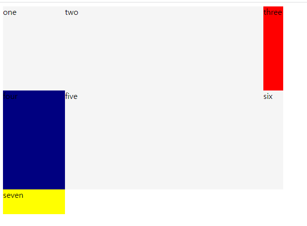

# 그리드 레이아웃

그리드는 **격자 구조를 만드는 행과 열, 모듈로 구성**된다.

현재 그리드 레이아웃디자인을 할수있는 CSS프레임 워크는 `bootstrap`과 `Susy`등을 예로 들수있다.

그리고 CSS Grid가 등장하여 프레임 워크를 사용하지 않아도 된다.

## 웹 레이아웃

### 초창기

- 레이아웃을 위한 디자인 방법은 없었고 텍스트 디자인만 가능했던 시기

  

### 테이블 레이아웃

- border를 투명하게 설정한 테이블을 사용해 멀티 컬럼 디자인이 시작됨

- 여백은 투명한 GIF 이미지를 사용함

- 웹 레이아웃이 발전했던 시기

  

### 프레임 레이아웃

- 테이블레이아웃 + 프레임기술

- 여러장의 HTML 문서를 결합해 하나의 문서를 사용했다.

- 페이지를 분리함으로서 편리했으나 Ajax 비동기 통신기술로인해 더이상 사용안한다.

  

### CSS 레이아웃

- HTML로 레이아웃을 하지않고 CSS로 하기시작

- `float` 과 `position`을 사용함

  

### Flexbox 레이아웃

- XY축방향으로 요소를 배치,정렬할 수있으며 자유도가 높아졌다.

- Bootstrap에서 사용하는 기술

  

### Grid 레이아웃

- 그리드 시스템을 언어 차원에서 지원하게되었다.
- 더이상 기존의 그리드 프레임 워크를 사용할 필요가 없어짐
- 반응형 웹 레이아웃 대응도 가능

## 그리드 용어

- Grid

  그리드 컨데이너는 행과 열을 가짐 그곳에 아이템을 배치할수있다.

- Grid Line

  행과 열을 그리는 선을 말하며 각선은 라인넘버를 가짐

- Grid Track

  라인사이의 공간

- Grid cell

  한 셀 (가장 작은 단위)

- Grid Area

  4개의 그리드 라인이 모여서 만든 영역

- Grid Gutters

  행과 열 사이의 간격

## Flexbox vs Grid

- Flexbox
  - X,Y축 하나의 축을 통해서 요소를 배치함
  - 상향식 접근법을 사용함
  - 복잡한 레이아웃을 작성하게됨
- Grid
  - 두개의 축을 모두 사용해서 요소를 배치함
  - 레이아웃에 하향식 접근법을 사용함
  - 미디어쿼리와 그리드를 사용하면 디바이스에 최적화된 인터페이스를 제공함

두개 다 상호보완적이며 프로젝트에 따라서 선택해 사용하면 된다.

## 해보자

이거만들꺼임

125     440 

170     420

125

200

120  360

140  140     40 

​					50 

​					40

​	                 50

????
