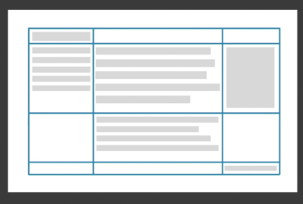
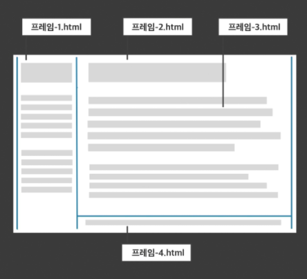
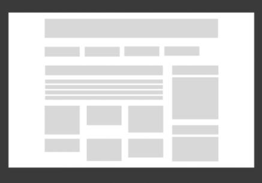
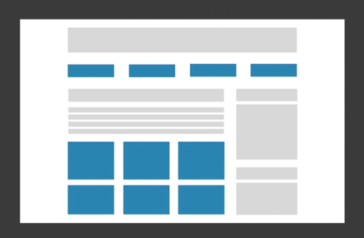
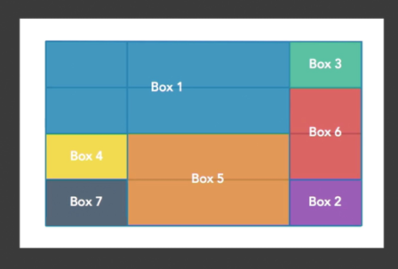

# 그리드 레이아웃

그리드는 **격자 구조를 만드는 행과 열, 모듈로 구성**된다.

현재 그리드 레이아웃디자인을 할수있는 CSS프레임 워크는 `bootstrap`과 `Susy`등을 예로 들수있다.

그리고 CSS Grid가 등장하여 프레임 워크를 사용하지 않아도 된다.

## 웹 레이아웃

### 초창기

- 레이아웃을 위한 디자인 방법은 없었고 텍스트 디자인만 가능했던 시기

  

### 테이블 레이아웃

- border를 투명하게 설정한 테이블을 사용해 멀티 컬럼 디자인이 시작됨

- 여백은 투명한 GIF 이미지를 사용함

- 웹 레이아웃이 발전했던 시기

  

### 프레임 레이아웃

- 테이블레이아웃 + 프레임기술

- 여러장의 HTML 문서를 결합해 하나의 문서를 사용했다.

- 페이지를 분리함으로서 편리했으나 Ajax 비동기 통신기술로인해 더이상 사용안한다.

  

### CSS 레이아웃

- HTML로 레이아웃을 하지않고 CSS로 하기시작

- `float` 과 `position`을 사용함

  

### Flexbox 레이아웃

- XY축방향으로 요소를 배치,정렬할 수있으며 자유도가 높아졌다.

- Bootstrap에서 사용하는 기술

  

### Grid 레이아웃

- 그리드 시스템을 언어 차원에서 지원하게되었다.
- 더이상 기존의 그리드 프레임 워크를 사용할 필요가 없어짐
- 반응형 웹 레이아웃 대응도 가능

