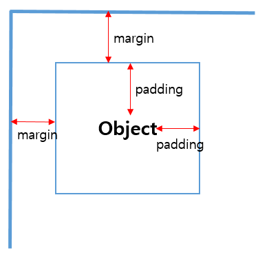
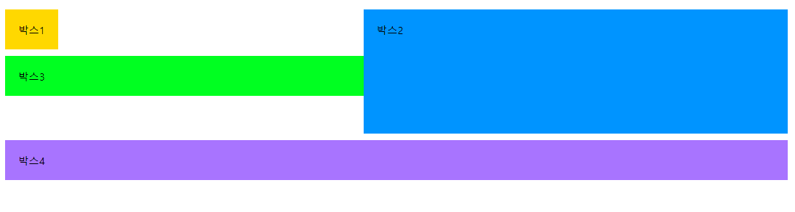
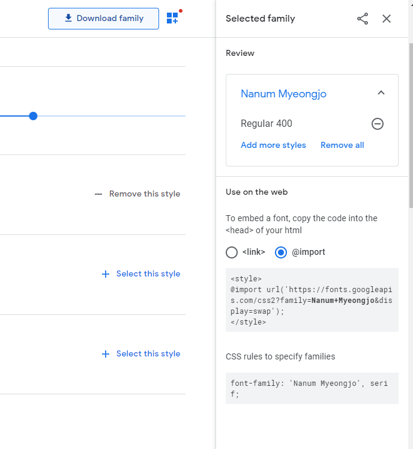

반응형 웹 디자인

웹브라우저 크기에따라 변화하는 방법


선택자 {속성1:속성값1; 속성2 : 속성값2}


css minify


-----------


### :earth_asia: 스타일 시트

스타일을 모아둔것을 스타일 시트라고함


브라우저 스타일

​	브라우저에서 정해진 스타일

사용자스타일

- 인라인 스타일 : 스타일을 직접적으로 적용한것

- 내부 스타일 시트 : 스타일 태그를 통해서 같은 문서안에 스타일을 정리해놓은 것

- 외부 스타일 시트 : 외부에서 스타일을 갖고오는것

  ```html
  <link rel="stylesheet" href="경로">
  ```


--------


### :ocean: CSS 적용방식

- 전체 선택자

  ```html
  <style>
      *{
          margin:0;
      }
  </style>
  ```

  "*" 을 통해서 해당 웹문서 전체에 적용

  

- 타입 선택자

  ```html
  <style>
      p{
          font-style: italic;
      }
  </style>
  ```

  태그 이름을 적어줌으로 해당 태그에 CSS 적용

  

- 클래스 선택자

  ```html
  <style>
      .bg_color{
          background-color: #ffff;
      }
  </style>
  
  ...
  
  <div>
      <h1 class="bg_color">
          제목
      </h1>
  </div>
  ```

  적용하고픈 CSS 을 클래스로만든다. ( "." 필수) 그리고 해당 태그에  클래스 적용


- id  선택자

  클래스 선택와 비슷하다 

  그런데 다른점은 "." 이 아닌 "#" 을 쓰고 id 라는 것

  

- 그룹 선택자

  ```html
  //여러선택자를 합치는것
  h1 ,p{
  	text-align: center;
  }
  ```


---------


### :tada: 캐스케이딩

css 는 우선순위가 있는 스타일 시트

사용자스타일 - 제작자스타일 - 브라우저 기본 스타일

​	:one: !important 

​	:two: 인라인 스타일 

​	:three: id 스타일

​	:four: 클래스 스타일

​	:five: 타입스타일


---------------


### :lantern: 텍스트 표현 :lantern:

:pencil2: 폰트

- font-family
- font-size
  - em ,rem
- font-style
- font-weight


:rainbow: 색깔

- 16진수
- hsl

- rgb, rgba

  +투명도를 통해서 느낌있게 글씨 쓰기 가능


:straight_ruler: 정렬

- text-align
- line-height
  - 이걸 height 과 같게 맞추면 중앙에 둘수있다.


:bomb: 텍스트 효과

- text-decoration
  - none
  - underline
  - overline
  - line-through

- text-shadow

  - ```html
    text-shadow: none | 가로거리 세로거리 번짐정도 색상
    ```

- text-transforn
  - none
  - capitalize : 첫글자 대문자
  - uppercase : 다 대문자
  - lowercase : 다 소문자
  - full-width : 가능한 모든문자를 전각 문자 (안되는데? 뭐지)
- letter-spacing , word-spacing
  - 자간, 글자 간격


------------


### :iphone: 목록

- list-style-type
- list-style-image
- list-style-position
- 이걸 일일이 다 안쓰고 **list-style** 에 다쓰면됨

```html
ol{
	list-style-type: lower-alpha;
	list-style-position : inside
}

ol{
	list-style: lower-alpha inside;
}
```


---------------


### :black_square_button: 블록

- 블록레벨요소 -혼자 한줄차지함

```html
<h1></h1>
<p></p>
```

- 인라인 요소 - 차지하는 영역만 

```html
<span></span>

```

- 박스모델 요소




- box-sizing

  border-box : 테두리 포함한 너비 ( default )

  content-box : 콘텐츠만의 너비

- box-shadow

  ```html 
  box-shadow: <수평거리> <수직거리> <흐림정도> <번짐정도> <색상> inset 
  ```

  inset 은 안쪽 그림자

- border-width
- border-color
- border-radius
  - 이걸로 원형의 사진 만들기 가능
  - 잘조절하면 타원형도됨
- margin
  - 마진중첩/ 마진상쇄 - 마진끼리 부딪히면 큰쪽이 먹음
- 패딩


- display

  - block
    - 인라인을 블록으로
  - inline
    - 블록을 인라인으로
  - inline-block
    - 둘다
  - none
    - 화면에 표시안함

- float

  - left
  - right
  - none(default)

- clear

  - float 속성은 이어지기 때문에 없애야함

  ```html
  <head> 
  	<style>
          div {
              padding:20px;
              margin:10px;
          }
          #box1{
              background:#ffd800;
              float:left;  /* 왼쪽으로 플로팅 */ 
          }
          #box2 {
              width: 50%;
              height: 150px;
              background: #0094ff;
              float:right;  /* 왼쪽으로 플로팅 */
          }
          #box3 {
              background: #00ff21;
              clear: left;
          }
          #box4 {
              background:#a874ff;
              clear:left;  /* 플로팅 해제 */
              clear:right;
          }
      </style>
  </head>
      <body>
          <div id="box1">박스1</div>
          <div id="box2">박스2</div>
          <div id="box3">박스3</div>
          <div id="box4">박스4</div>
      </body>
  ```

  

  


- postion
  - left, right, top, bottom
  - static
    - 기본, 문서에 흐름에 맞춰서 배치
  - relative
    - 위칫값지정가능
  - absolute
    - 상위요소 기준으로 배치 (relative 있어야됨!! 없으면 기본페이지가 상위요소)
  - fixed
    - 고정


--------------

### Site

**폰트 구글 사이트**

https://fonts.google.com/

고르고 @import를 통해서 입력해준다.



**웹폰트를 변환하는 사이트**

https://transfonter.org/