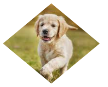
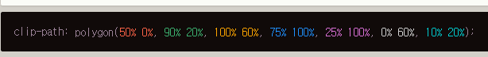

# 마이크로 인터렉션

https://ichi.pro/ko/gineung-geomsaeg-eul-wihae-facebook-ui-maikeulo-inteolaegsyeon-eul-dasi-mandeun-bangbeob-219477100300919


### Clip-path

https://developer.mozilla.org/ko/docs/Web/CSS/clip-path

요소의 클리핑 범위를 지정합니다. 클리핑범위는 안의 부분은 보여지고 바깥은 숨겨진다.

이를 통해서 이미지를 복잡한 모양으로 만들수있다.!!!!!

```css
#Dog {
  clip-path: circle(40%);
}
```

```html
<body>
  <link rel="stylesheet" href="test.css">
  
</body>
```


```css
#Dog {
  clip-path: polygon(50% 0%, 100% 50%, 50% 100%, 0% 50%);
}
```



https://bennettfeely.com/clippy/

이런 클립패스를 만들어주는 곳도있다.




폴리곤이 대중적으로 쓰이지 않을까 생각되는 부분인데, 점이 추가되는 식이여서 어렵지않아보인다.

