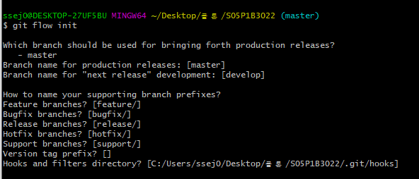
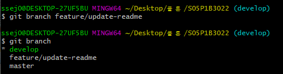
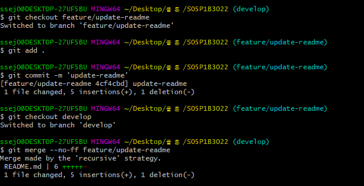
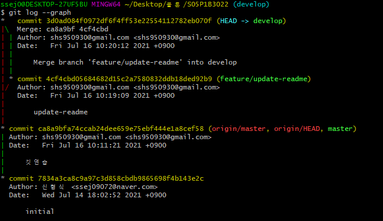
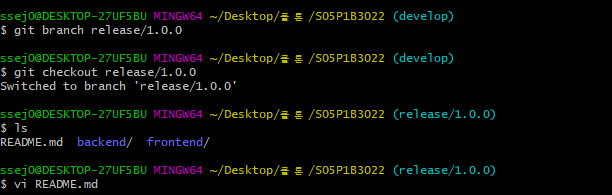
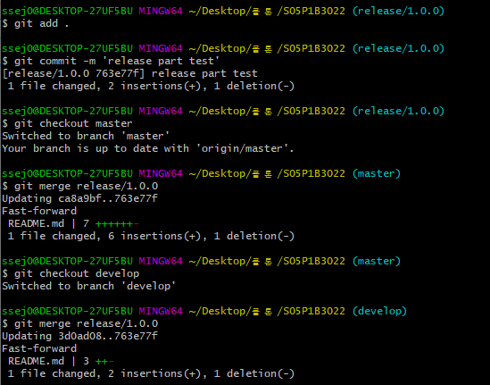
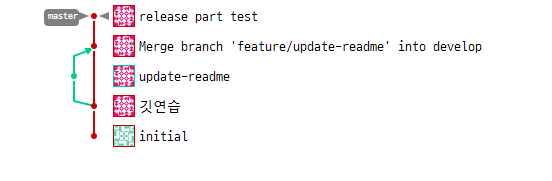

# Github


- 레포짓토리 등록하기

```bash
git init
git add .
git commit -m "프로젝트 시작"
git remote add origin 깃주소
git push origin master
```


- 파일 받아오기

```bash
git clone 깃주소
```


- 수정한걸 master에 반영하자

```bash
# 브랜치 만들고
git branch 브랜치이름

# 만든 브랜치로 가기
git switch 가고자하는 브랜치이름


# 브랜치에서 업데이트 하기
git add .
git commit -m '변경점'
git checkout master
git merge 합치고자하는 브랜치이름
git push origin master
```


- master 수정된걸 가져오자

```bash
#마스터로 가서 받아오기
git checkout master
git pull origin master

#마스터가서 받아온거 자기 브랜치에 추가하기
git checkout 자신의 브랜치
git merge master
```


- 깃헙 로그보기

```bash
git log --online -10
```


- 커밋 뒤로 돌아가기

```bash
# 돌아가고자하는 해당 commit
git revert commit한 번호(ex.c23ksd32)

# 변경한거 말해줘야됨
git add .
git commit -m '변경함!'
git push origin 자기브랜치
```


## Git flow

```bash
# 1.깃플로우 시작 
git flow init
```




```bash
# 2. 추가기능 구현을 위한 브랜치 생성
git branch feature/{기능}
```




```bash
# 3. 해당브랜치에서 작업이후 develop에 병합
git checkout feature/{기능}
git add .
git commit 
git checkout develop
git merge feature/{기능}
```




```bash
# 4. 그래프 확인
git log --graph
```




```bash
# 5. release 파트
#	 release 브랜치에서는 현재 버전에서 만든 기능들을 점검하고 필요시 수정
```




```bash
# release 파트는 비슷한 맥락 
# 다하고서 master에 병합 추가로 develop에서 병합하는걸 잊어서는 안된다.
```




이런식으로 깃에 나타남 근데 왜 release는 반영 안되는가..




## **git branch로의 업데이트**

> git conflict 발생&해결 실습

- A랑 B가 **같은 파일을 수정했을 때**

  gitlab에서 A 브랜치 MR하고 B 브랜치 merge에서 충돌 발생

  B 브랜치 로컬에서 master pull (gitlab에서 어떻게 하라고 나옴)

  B 브랜치에서 push master

  **A에서 작업한 내용 commit 해야함! (이거 진짜 중요!!)**

  A에서 pull master

  A에서 vscode에서 보면 양 쪽 수정사항이 다 보이고 어떤거 적용할지 선택 가능

  둘다선택

  A 브랜치에서 add/commit/push

  둘 다 반영 ok