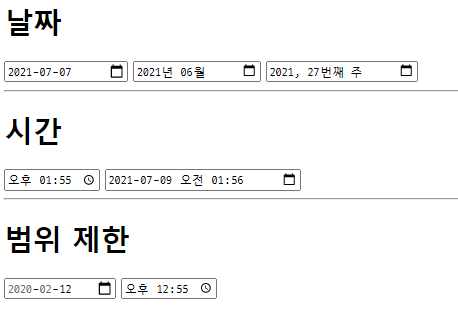

- \<!DOCTYPE html>

  HTML5 문서라는 것을 알려줌

- \<html>

  ```
  <html lang='ko'>
  </html>
  검색에 용이, 한국어로된 문서를 검색한다.
  ```

  

### \<head>

- \<title>

  웹브라우저의 제목으로 표시됨

- \<meta>

  메타정보 = 데이터를 설명하는 정보

  ```
  <meta chrset="UFT-8">
  
  // 화면에 글자를 표시할떄 어떤 인코딩을 쓸것인가.
  // 글씨가 깨질수도있다
  
  <meta name = 'github' content='html 공부'>
  
  //이런식으로 내용을 설명
  ```

  


### 시멘틱 태그

- 의미론적으로 표현
- 쉽게 구분하기 위해

```html
<header></header>
<nav></nav>
<main></main>
<article></article>  //독립된 컨텐츠
<section></section>	 //컨텐츠를 묶는 용도
<aside></aside>
<footer></footer>
```


### 텍스트 태그

```html
<h?></h?>
<p></p>
<br>
// 텍스트 단락은 p 를쓰자 br 쓰면 CSS 에서 뭉개진다.

<blackquote></blackquote>
// 인용문 살짝 들여쓰기 된다.

<strong></strong>
<b></b>
// 의미중요 0,x


<em></em>
<i></i>
// 강조이텔릭, 그냥 이텔릭

<small></small>
// 작게
<u></u>
// 밑줄

<sup></sup>
<sub></sub>
// 위첨자, 아래첨자

<s></s>
// 취소선
```


### 리스트

```html
<ol type ="1" start="3">
    <li></li>
    <li></li>
</ol>

<ul>
    <li></li>
</ul>
```

- type ="1" , "a", "A", "i", "I"  타입은 리스트에 순서를 붙어준다. (숫자,알파벳,로마자)

- start 는 시작을 정한다.
- ul ol 은 순서 차이


```html
<dl> 
    <dt>3단</dt>
    <dd>3X1 = 3</dd>
    <dd>3X2 = 6</dd>
</dl>
```


### 테이블

```html
<table>
    <caption>제목</caption>
    <tr>
    	<th>열 1</th>
        <th>열 2</th>
    </tr>
    <tr>
    	<td>(1,1)</td>
        <td>(1,2)</td>
    </tr>
    <tr>
    	<td>(2,1)</td>
        <td>(2,2)</td>
    </tr>
</table>
```


```html
<thead></thead>
<tbody></tbody>
<tfoot></tfoot>
// 테이블 섹션을 좀 나누고 싶은 경우
// 그런데 보이는 구조는 같음
```


```html
<td rowspan="합칠개수">내용</td>
<td colspan="합칠개수">내용</td>
//그럼 다음 행이나 열에서는 안적어줘도 됨
```


```html
<colgroup>
	<col>
</colgroup>
//특정열에대해서 스타일을 제공할수있음
//무조건 caption 태그 다음에 써야됨
//열의 개수만큼 col을 넣어야됨
//col 속성이 같으면 span을 써주자 span ="개수" -> 그만큼 col 안써줘도 됨
```


- 예시

```html
<table>
      <caption>제목</caption>
      <colgroup>
        <col span="2" style="background-color: bisque; width: 20%;" >
        <col style="width: 120%;">
      </colgroup>
      <thead>
        <tr>
          <th>\</th>
          <th>이름</th>
          <th>어떤 개발자가 되고 싶은지</th>
        </tr>
      </thead>
      <tbody>
        <tr>
          <td rowspan="2">행</td>
          <td>신형식</td>
          <td>프론트 끝장낼껍니다!</td>
        </tr>
        <tr>
          <td>이세돌</td>
          <td>네? 바둑 두러갈껀데요?</td>
        </tr>
      </tbody>
  </table>
```


### 멀티미디어

```html

//이미지 안뜨면 텍스트로 나옴
```


```html
<object width="" height="" data="파일"></object>
//파일에 pdf나 오디오 다양한 멀티미디어 파일 삽입 가능

<embed src="" height="" width="">
//옛날부터 써오던거 , 닫는 태그가 없다.

//mp4 mp3 지원

<video src="" controls width=""></video>
<audio src=""></audio>
// 추가적인 설정
// controls(제어바) autoplay(자동재생) loop(반복) muted(음소거) poster="파일이름"(비디오 썸네일)
```

- 멀티미디어 부분은 HTML5로 넘어가면서 많이 바뀐 부분이다.

- 웹브라우저에서는 autoplay를 금지한다.


```html
<a href="링크" target="_blank"></a>
// _blank를 해주면 새로운 탭으로 나타난다.
```


### 폼

- 웹사이트로 정보를 보낼 수 있는 모든 요소는 폼이다.

```html
<form action="">
    <fieldset> //구역을 나눠줌
        <legend> // 구역의 제목
           	신형식
        </legend>
        <p>
            나이 : 27세
            <br>
            취미 : 코딩
        </p>
    </fieldset>
</form>
```


```
action	: 폼 태그안에 내용을 처리해줄 서버프로그램 저장
method	: 입력한 내용을 어떻게 넘겨줄것인지 (get: 내용다보임 post: 내용안보임)
name	: 폼의 이름
target	: action 에서 지정한 파일을 다른창에서 열게함
```


- input

  input에는 타입이 줜내 많다.

  ```html
  <label>아이디<input type="text"></label>
  //폼요소에 붙여서 사용
  
  <label for="user-id">아이디</label>
  <input type="text" id="user-id">
  // 이케하면 멀리있어도 연결가능
  // for - id 매치
  ```

  

  - radio

  ```html
  <p>
      <label for="c">메일 수신</label><input type="radio" name="mail" id="c">
  	<label for="d">메일 수신안함</label><input type="radio" name="mail" id="d">
  </p>
  // 라이오 체크박스에서 이름을 같게 하면 하나만 골라야된다.
  ```

  - range , number

    - min max 설정가능
    - step 으로 간격가능
    - value - 초기값

  - date,month,week

    ```html
      <form>
        <h1>날짜</h1>
        <input type="date">
        <input type="month">
        <input type="week">
        <hr>
        <h1>시간</h1>
        <input type="time">
        <input type="datetime-local">
        <input type ="datetime"> //위에랑 같은거 그리고 지금시간으로 설정해줌
        <hr>
        <h1>범위 제한</h1>
        <input type="date" min="2020-02-01" max="2020-02-15">
        <input type="time">
      </form>
    ```

    

  

  - submit / reset
    - submit 은 action 에 저장된 값으로 데이터가 옮겨진다.

  - image
  - button
    - onclick으로 버튼을 눌럿을떄의 행동을 자바스크립트로 실행할수있다.
  - file
    - 파일첨부
  - hidden
    - 화면 폼에는 안보이지만 폼과함께 서버로 전송됨

  ----------

  기능

  - autofocus
  - placeholder
  - readonly
  - required
    - submit 할때 필수요소 설정
  - checked

  --------

  

- textarea

  ```html
  <label for="memo">메모장</label>
  <textarea id="memo" cols="40" rows="4"></textarea>
  ```

  

- 드롭다운 

  - select/option

  ```html
  <select size="보이는 개수" mutiple>
      <option value="1" selected>가</option>
      <option value="2">나</option>
      <option value="3">다</option> 
  </select>
  ```

  multiple 은 여러개를 고를수있고 드래그하면 된다.


- 데이터 목록

  - datalist / option
  - 드롭다운에서는 값을 직접 입력해야한다. 근데 이걸쓰면 불러오는 방식

  ```html
  <label for="person">성별</label>
  <input type="text" id="person" list="sex" >
  <datalist id="sex">
  	<option value="man">남</option>
      <option value="woman">여</option>
  </datalist>
  ```

  

  

