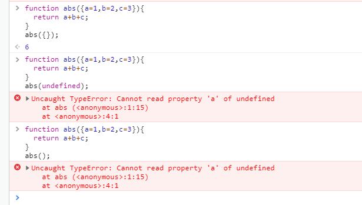

참고[ 모던 자바스크립트 핵심 가이드]


# :rabbit2: var / let / const

ES6가 되면서 변수정의에 'let' 과  'const' 가 추가되었다.


기존 var의 경우 함수스코프에서 종속되며  for 루프 안에서 선언해도  루프밖에서도 접근가능하다.


let 은

블록스코프에 종속된다. 선언된 부분과 그하위에서만 사용가능


const 는

let 과 마찬가지로 블록스코프에 종속된다.

차이점은 값의 재할당이 불가능하다.

객체 값의 재할당이라면?? 상관없다. 속성을 재할당하는 행위이기 때문

```javascript
const energy = {
	speed:2.5,
	power:40,
}
energy.speed =3;
console.log(energy.speed);
// 3

Object.freeze(energy); 
// 이것을 통해 속성값 역시 불변하게 만들수있다.
```


var /  let,const 의 대표적인 차이가 있다면 TDZ에 영향을 받는가 이다.

TDZ 는 어휘적 바인딩이 실행되기 전까지 액세스할 수 없는 현상이다.


그 결과로 

var의 경우 정의되기전 접근이 가능하다! (undefined 지만..)

하지만 let, const 의 경우 에러가 떠버린다.  정의를 꼭 먼저해야하는 것! :man_judge:


이러한 과정이 Hoisting 이라는 개념과 관련이 많다.

> Hoisting 이란

> 스코프 안의 어디에서든 변수 선언은 최상위에서 선언된 것과 동등하게하는 것이다.

즉 var 는 Hoisting이 가능한것이다.

그런데 그럼  let, const는 불가능한걸까? 결론적으로 가능하지만 의미는없다.

 let, const은 선언되기전 TDZ 에 있기때문에 이를 접근하려고하니 에러가 생기는 것이기 때문이다.


 

정리

```
1. 변수정의에는 const, let 있다.
2. 재할당이 필요한 경우 let 그외엔 const를 쓰자 
3. ES6 에서 var는 쓰지않는다.
```


# :bow_and_arrow:화살표 함수

ES6 가 나오면서 "=>" 를 통해 함수를 선언하는 방법이 생겼다.


기존의 ES5 의 함수선언

```javascript
const multiple = function(a,b){
	return a*b;
}
```


ES6 의 화살표함수 적용

```javascript
const multiple = (a,b) => {
	return a*b;
}

// 더 간단하게?

const multiple = (a,b) => a*b;
```


뭐가 달라졌나면 `function(a,b)` 가 ` (a,b) =>` 으로 표현이 가능해졌다.

그외

- 매개변수가 하나인 경우

```javascript
const num = a =>{
	return `${a} 명 생존`;
}
// () 생략이 가능하다.
```


- 그러면 매개변수가 없으면????

```javascript
const num = () =>{
	return "자바스크립트 어려지않아오";
}
// () 는 무조건 적어줘야한다.
```


### :thinking: 그런데 이것뿐인가??

먼저 `this` 에서 변화가 생긴다. (**중요**)

기존 ES5 함수안에서 `this`를 사용하면 `this`는 해당 함수를 가리킨다.

하지만 화살표함수를 사용할경우 `this`는 상위스코프에 상속이 된다.

// 이는 최근에 프로젝트를 진행하면서도 겪었던 문제였다.

https://medium.com/@hozacho/vuejs%EC%97%90%EC%84%9C-arrow-function%EC%9D%84-%EC%82%AC%EC%9A%A9%ED%95%B4%EC%95%BC%ED%95%98%EB%8A%94-%EC%9D%B4%EC%9C%A0-ec067c342412


```html
<div class="box open">
    box
</div>
```

```css
.open{
    background-color: red;
}
```

```javascript
const box = document.querySelector(".box");
box.addEventListener("click",function(){
    this.classList.toggle("open");
    setTimeout(function(){
        this.classList.toggle("open");
    }, 500);
});

// 여기서 첫번째 this는 box를 가리키고 두번째 this는 window를 가리킨다.
// 두번째 this 역시 상위 스코프인 box를 가리키려면 =>를 사용하자.

box.addEventListener("click",function(){
    this.classList.toggle("open");
    setTimeout(()=>{
        this.classList.toggle("open");
    }, 500);
});
```


주의해야될점은 상위스코프에 상속이되므로 

상위스코프가 window인 경우에는 의도한게 아니라면 피하도록 하자.


추가적인 차이점으로 arguments 객체에 대한 접근방식이다.

```javascript
function study(){
	consle.log(arguments[0]);
}

study(css, HTML, JavaScripts)
// css
```


`this`처럼 `arguments` 역시 화살표함수를 사용하면 부모스코프의 값을 상속한다.

오히려 값이 안나올수있으니 화살표 ,function 을 구분해서 사용해주자.


# :black_joker: ​기본값 

ES6 에서 기본값을 설정하는데 편의를 개선했다.


```javascript
function mystatus(power=10, dex=10, int=10){
	return power*0.2 + dex*0.8 + int;
}

mystatus(30)
// 24
// 값을 정해주지않으면 기본값으로 설정된다.
```

 

###  :thinking: power 값을 설정 안하고, 나머지를 설정하고 싶으면 어떻게 해야할까?

```javascript
mystatus(undefined,30,30)
// 이렇게 해줘도 되긴한다.
```

조금 더 좋은방식으로 써보자


destructuring 을 사용하자

```javascript
function mystatus({power=10, dex=10, int=10} = {}){
	return power*0.2 + dex*0.8 + int;
}
// 이런식으로 인수를 바꿔주면

mystatus({dex = 30, int = 30});
//이렇게 받을수가있다.

mystatus({});
// 이러면 기본값으로 설정된다. //20
```





`={}` 를 빼고 진행했다. 그런데 왜 `abs({});` 는 되는건지 의문이긴하다. (책에선 안된다고 했음!)


# :seat: 템플릿 리터럴

ES6에서 백틱` `` `을 통한 문자열 삽입이 가능해졌다.

 

```javascript
let name='신형식';
const greeting = `제 이름은 ${name}입니다. 반갑습니다.`;
console.log(greeting);
// "제 이름은 신형식입니다. 반갑습니다."

let a=4;
let b=5;
console.log(`a+b = ${a+b}`)
//a+b = 9

let hi = `안녕하세요
반갑습니다.`
// ``을 통해서 여러줄을 감싸는것도 가능해졌다.
```

이와 연계해서 

삼항연산자나 함수를 넣어서 사용하는등 다양하게 사용할 수 있다.


# :sunflower: 문자열 메서드

문자열에 해당하는 기존 메서드들을 살펴보자

```javascript
const str = "How are you DOING?"
str.indexOf("are");
//4
str.slice(0,5);
//How a
str.touppperCase();
//HOW ARE YOU DOING?
str.toLowerCase();
//how are you doing?
```


새로운 메서드들을 살펴보자

```javascript
const str = "How are you DOING?"
str.starsWith("How");
//true
str.starsWith("How",3);
//false 3개이후를 검사!
str.endsWith("Ing");
//false
str.endsWith("w",3);
//true 첫믄자 3개만 고려!
str.Includes("are");
//true
str.repeat(3);
//"How are you DOING?How are you DOING?How are you DOING?"
```

알아야할것

- 대소문자를 구별한다.


# :dagger:디스트럭처링


