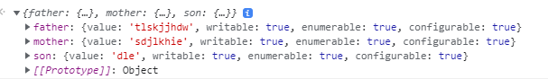

# ES2017


# Padding

- 패딩을 추가 할수있다!

  - padEnd()
  - padStart()

  ```javascript
  "hello".padEnd(7);
  //'hello  '
  // 총 7글자의 공간이 확보되고 2자리가 남는다.
  "hello".padEnd(7,"g");
  //'hellogg'
  //패딩 공간 역시 다른것으로 채울 수 있다.
  ```

  padStart() 를 잘쓰면 이런것도 가능하다.

  ```javascript
  const fruits = ["banana","apple","gu"]
  fruits.forEach( str => console.log(str.padStart(10)));
  //     banana
  //      apple
  //         gu
  ```

  마치 오른쪽 정렬이 된 것 같다.


# 객체 내부 접근

- 객체 내부값에 접근하기!

  - Object.entries()
  - Object.values()

  ```javascript
  const family={
      father:"tlskjjhdw",
      mother:"sdjlkhie",
      son:"dle"
  };
  Object.entries(family)
  //[
  //	['father', 'tlskjjhdw'],
  //	['mother', 'sdjlkhie'],
  //	['son', 'dle']
  //]
  
  Object.values(family)
  //['tlskjjhdw', 'sdjlkhie', 'dle']
  ```

  배열로 반환한다는 것이 특징이다.

  - Object.getOwnPropertyDescriptors()

    이 메서는 객체가 소유한 모든 속성 설명자를 반환한다.

  ```javascript
  Object.getOwnPropertyDescriptors(family)
  ```

  


# 어토믹스

- 멀티스레드 환경을 지원하기 위해서 **어토믹스** 가 도입되었다.

  메모리가 공유되면 여러스레드가 메모리에서 동일한 데이터를 읽고쓰는데 이환경에서 어토믹스는 정확하게 값을 쓰게한다.
  
  어토믹스는 생성자가 아니며 정적이다.
  
- 어토믹스의 메서드

  - add / sub
  - and / or / xor
  - load / store
  - 범용 고정 길이 바이너리 데이터 버퍼를 표현하는 SharedArrayBuffer 객체와 함께 사용된다.

```javascript
const buffer = new SharedArrayBuffer(16);
const uint8 = new Uint8Array(buffer);
uint8[0] = 10;
console.log(Atomics.add(uint8,0,5));
//10

console.log(uint8[0]);
//15

console.log(Atomics.load(uint8,0));
//15
```

에러가 떠서 시도해보려고 하니 이런 에러가 뜬다. 브라위저에서 막혀있는듯하다.


Atomics.add 를 호출하면 해당배열 인덱스에 전값이 반환된다.

uint8을 넣어 다시 호출하면 15를 반환한다


값을 불러올때는 Atomics.load를 사용하면 된다. 인수는 배열과 인덱스를 넣으면 된다.