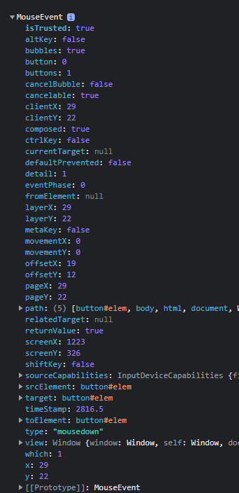

# Event 기초

## 브라우저 이벤트 소개

### 이벤트 

- 모든 DOM 노드는 이벤트를  만들어내며 이벤트는 DOM에 한정해서 일어나지 않습니다.
- 마우스 이벤트
  - `click` `contextmenu` : 좌클, 우클 
  - `mouseover`와 `mouseout` : 마우스 위에 올릴때, 벗어 날때
  - `mousedown`과 `mouseup` : 마우스 누를때, 뗄때
  - `mousemove` – 마우스를 움직일 때 발생합니다.
- 폼 요소 이벤트
  - `submit` – 사용자가 `<form>`을 제출할 때
  - `focus` – 사용자가 `<input>`과 같은 요소에 포커스 할 때
- 키보드 이벤트
  - `keydown` `keyup` : 키보드 누를 때, 뗄 때
- 문서 이벤트
  - `DOMContentLoaded` – HTML이 전부 로드 및 처리되어 DOM 생성이 완료되었을 때
- CSS 이벤트
  - `transitionend` – CSS 애니메이션이 종료되었을 때

### 이벤트 핸들러

- 이벤트에 반응하기위해서 실행되는 함수인 `핸들러`를 할당 해야됩니다.

- HTML 속성, DOM 프로퍼티

  - `onclick` 

    - HTML 속성은 대소문자를 구분하지 않습니다.
    - DOM 프로퍼티는 대소문자를 구분합니다.

  - `onclick`의 프로퍼티는 하나밖에 없기 때문에 복수의 이벤트 핸들러를 할당할 수 없습니다.

  - `null`을 할당하여 핸들러 제거가 가능합니다.

  - `this`를 활용하여 요소에 접근이 가능합니다. `this`는 핸들러가 할당된 요소!!

    ```js
    <button onclick="alert(this.innerHTML)">클릭해 주세요.</button>
    ```

  - `setAttribute`로 핸들러를 할당하면 안됩니다.

    - 속성은 항상 문자열이기 때문에, `onclick`에 달린 함수 자체가 문자열이 되버림

- 복수의 핸들러를 적용하고 싶다면 `addEventListener`를 사용합니다.

  - 핸들러 삭제는 `removeEventListener`를 사용합니다.

  - ```js
    element.addEventListener(event, handler, [options]);
    // event: 이벤트 이름( click )
    // handler: 핸들러 함수
    // [options] : once / capture / passive
    element.removeEventListener(event, handler, [options]);
    // 동일한 함수를 받아야 삭제가 가능합니다. => 즉 변수에 핸들러 함수를 저장해야함
    ```

  - ```js
    <input id="elem" type="button" value="클릭해 주세요."/>
    <script>
      function handler1() {
        alert('감사합니다!');
      };
      function handler2() {
        alert('다시 한번 감사합니다!');
      }
      elem.onclick = () => alert("안녕하세요.");
      elem.addEventListener("click", handler1); // 감사합니다!
      elem.addEventListener("click", handler2); // 다시 한번 감사합니다!
    </script>
    ```

    - `addEventListener`를 써야만 하는 경우도 있습니다.

### 이벤트 객체

- 이벤트가 발생하면 브라우저는 `이벤트 객체`를 만듬 여기에 상세정보를 넣고 (어떤키가 눌렸다!), 핸들러에 인수 형태로 전달됨

  - `event`

    

  - `event.type` : 이벤트 타입(클릭)

  - `event.currentTarget` : 이벤트를 처리하는 요소 this가 가리키는 것과 같다.

    - 화살표함수나,다른곳에 바인딩 안했다면  `event.currentTarget` 로 요소정보 획득 가능

  - `event.clientX / event.clientY`

    - 커서 좌표

  - 이외에 다양한 프로퍼티가 있음

- 이벤트 객체는 HTML 핸들러 안에서도 접근이 가능합니다.

  ```js
  <input type="button" onclick="alert(event.type)" value="이벤트 타입">
  ```

### 객체 형태의 핸들러와 handleEvent

- `addEventListener`를 사용하면 객체를 이벤트 핸들러로 할당 가능합니다. (클래스 역시 가능)

  - 객체에 구현한 `handleEvent` 메서드가 호출됩니다.

  ```js
  <button id="elem">클릭해 주세요.</button>
  <script>
    let obj = {
      handleEvent(event) {
        alert(event.type + " 이벤트가 " + event.currentTarget + "에서 발생했습니다.");
      }
    };
  
    elem.addEventListener('click', obj);
  </script>
  ```

  - 심화버전

  ```js
  <button id="elem">클릭해 주세요.</button>
  
  <script>
    class Menu {
      handleEvent(event) {
        // mousedown -> onMousedown
        let method = 'on' + event.type[0].toUpperCase() + event.type.slice(1);
        console.log(this); //Menu
        this[method](event);
      }
  
      onMousedown() {
        console.log('onMousedown',event) // onMousedown,MouseEvent=> 이벤트 객체 갖고옴
        elem.innerHTML = "마우스 버튼을 눌렀습니다.";
      }
  
      onMouseup() {
        elem.innerHTML += " 그리고 버튼을 뗐습니다.";
      }
    }
  
    let menu = new Menu();
    elem.addEventListener('mousedown', menu);
    elem.addEventListener('mouseup', menu);
  </script>
  ```

  


## 버블링과 캡처링


## 이벤트 위임


## 브라우저 기본 동작


## 커스텀 이벤트 디스패치

