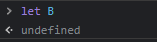

# 표현식과 문

> 자바스크립트 딥 다이브


"값"은 "표현식" 이 평가 되어서 생성된 결과다.

```js
10+20; //30	
```

이는 30이라는 값이 생성되므로 표현식이다.

여기서 값을 생성하는 기본적인 방법은 '리터럴' 이다.


### 리터럴

리터럴은 사람이 이해할 수 있는 문자 또는 약속된 기호를 사용해서 값을 생성하는 표기법이다.

이래서는 감이 안잡힌다. 


예시로

```js
3 // 3을 나타내는 숫자 리터럴이다.
```

여기서 자바스크립트 엔진은 이 리터럴('3')을 평가해서 3이란 값을 저장한다.

자바스크립트 엔진은 런타입에 리터럴을 평가하고 값을 생성한다.


리터럴을 값을 만들기위래서 미리 약속한 표기법이라고 생각하자

리터럴의 종류가 다양한데

```js
100;
10.5
0b110110;
"hello";
true;
null;
undefined;
[1,2,3];
```

이처럼 값으로 나타낼수있는 모든것은 리터럴이라고 보자


### 표현식

표현식은 값으로 평가될 수 있는 "문"이다.

방금 전의 경우 값을 나타낼수있는 리터럴도 표현식이다.


```js
var score = 50+50;
```

여기서 `50+50` 역시 값으로 평가 되기 때문에 표현식이다.

`score`는? 역시 표현식이다.


### 문

문은 뭐냐?

문은 프로그램을 구성하는 기본단위이자 최소실행 단위다.

문에는 조건문, 할당문, 반복문 등 다양하게 존재한다.

```js
var score = 50+50; //이게 하나의 문이다.
```

문은 여러개의 토큰으로 이루어져있는데,

토큰이란, 문법적의미를 가지고 더이상 나눌수 없는 코드의 기본요소를 의미한다.

`;` 이나 `+` 같은 경우가 토큰이다.


### ;

세미클론은 쓰는거가 권장된다. 


### 그럼 표현식이 아닌건 뭔가있냐

가장 쉬운점은 변수에 할당하는것이다. 

왜냐하면 표현식은 값으로 평가가 되기 때문이다.

```js
let a = let B; //이런건 되지않는다.
//Uncaught SyntaxError: Unexpected identifier

let b;
b=10;
let a = b=10; // 이런건된다. b=10 이건 표현식인것!
```


크롬 개발자 도구에서 표현식이 아닌문을 실행하게 되면 undefined를 출력한다.



