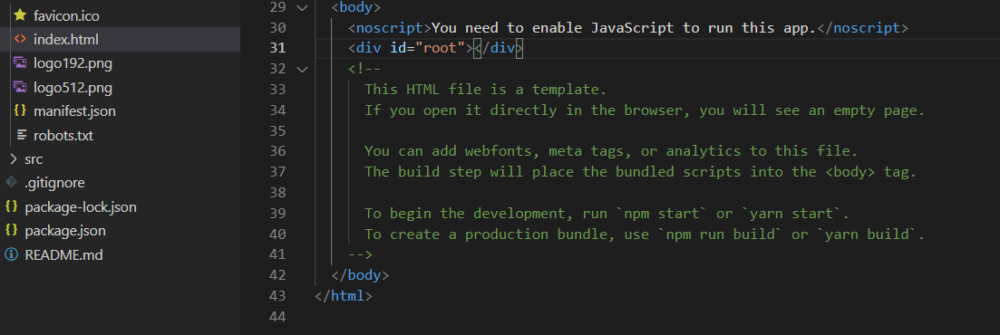
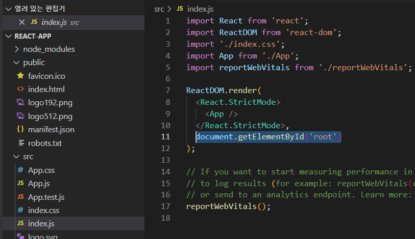
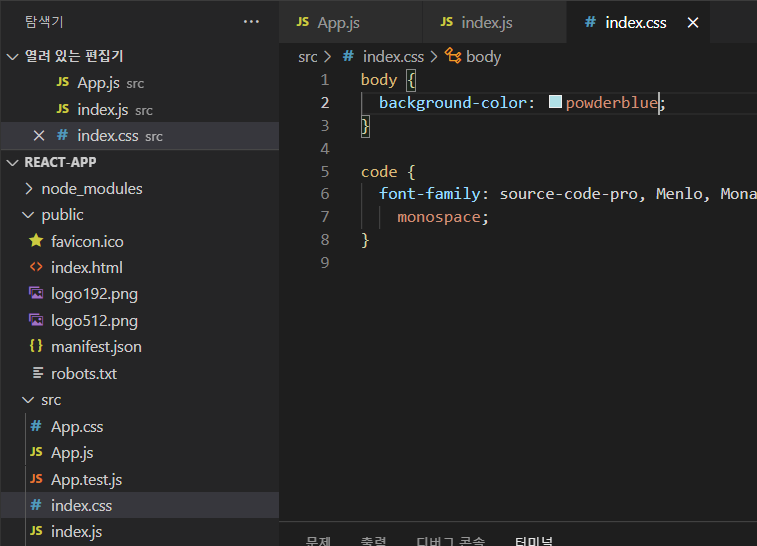
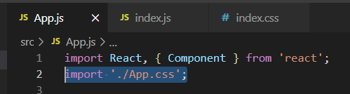
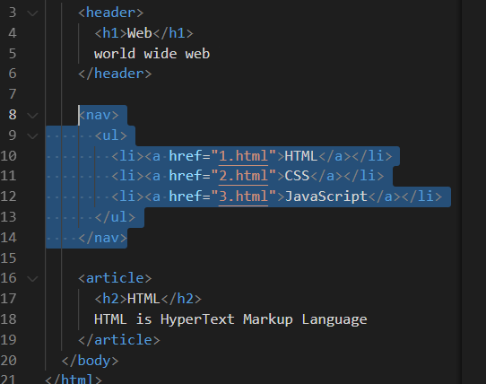
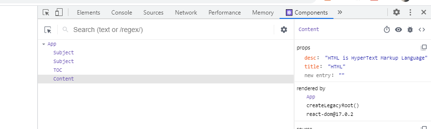
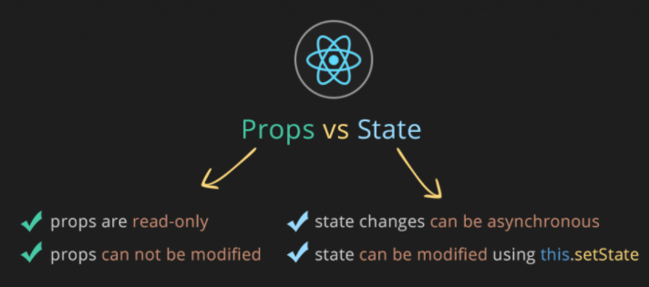

## 환경설정

- 리액트 설치

https://nodejsorg/ko/  노드js 먼저 

- npm 방법

```
npm install -g create-react-app
sudo npm install -g create-react-app
```

- 설치 확인

```
create-react-app -V
```

- npx 방법

애는 한번만함 (컴퓨터의 공간을 차지하지않음)

```
npx create-react-app
```


각 html 마다 사용자가 정의태그를 쓰면 좋지않을까?

이를 리액트에서 Component 라고 한다.

이 기능의 장점은

- 가독성 업! 

- 또한 서브페이지에 해당  Component를 재사용가능하다!

- 수정에도 동시에 바뀌기에 유지보수가 탁월함!


- 파일에 리액트 환경 설치

```
create-react-app .
```


- 실습환경 run

```
npm run start
```




루트가 짱


src 에서 작업을 진행 (뷰하고 비슷하네?)



루트를 받는다.

위에 'App' 사용자정의 태그 즉'Component'

그위에 ./App 은 App.js

App.js에서 생활코딩은 함수방식이 아닌 클래스방식으로 진행

css 변경






이거는 App이라는 Component 를 디자인함


- deploy

불필요하게 생성되는 용량을 제거

```
 npm run build
```


즉 서비스할때는 build 안에 있는 것을 배포한다.

```
$ npx serve -s build
```

- 이러면 데이터가 확연히 줄은채로 확인가능
- 파일또안 빌드안에 넣어주면 된다.


## Component

- 이걸 간단한 컴포넌트로 만들고싶다 ?



​	그게 리액트다.


- 컨포넌트 만들기

```react
class Subject extends Component {
  render(){
    return (
      <header>
        <h1>Web</h1>
        world wide web
      </header>
    );
  }
}
```

최상위 태그에 있어야됨

이제 

<Subject></Subject>를 쓰면됨


- props 를 기반으로 더 활용성 높은 컴포넌트 만들기

https://ko.reactjs.org/docs/components-and-props.html

```react
class Subject extends Component {
  render(){
    return (
      <header>
        <h1>{this.props.title}</h1>
        {this.props.sub}
      </header>
    );
  }
}

// 컴포넌트를 만드는 코드
class App extends Component {
  render() {
    return (
      <div className="App">
        Hello,React!!
        <Subject title="WEB" sub='world wide web'></Subject>
        <Subject title="REACT" sub='이게되네'></Subject>
        <TOC></TOC> 
        <Content></Content> 
      </div>
    );
  }
}
```


- 현재의 상태를 알아내려면?

리액트 디버거

https://chrome.google.com/webstore/detail/react-developer-tools/fmkadmapgofadopljbjfkapdkoienihi/related?hl=ko&




- 컴포넌트가 많아지면?

컴포넌트 분리!

```react
import React, { Component } from 'react';


class TOC extends Component{
  render(){
    return(
      <nav>
          <ul>
            <li><a href="1.html">HTML</a></li>
            <li><a href="2.html">CSS</a></li>
            <li><a href="3.html">JavaScript</a></li>
          </ul>
      </nav>
    );
  }
}

export default TOC;
```

`export default TOC;`  : TOC를 언제든 가져다 가서 쓸수잇다.

App.js 에서 import TOC from "./components/TOC" 추가! ( 불러와야하므로 )


## State

props 

state

컴포넌트에다가 프롭스를 적용

컴포넌트 내부적으로 사용되는것을 state

- 컴포넌트 초기화하기( 랜더보다 앞에서 실행 )

```react
  constructor(props){
    super(props);
  }
```

```react
class App extends Component {
  constructor(props){
    super(props);
    this.state = {
      subject:{title:"WEB", sub ="world wide web"}
    }
  }
```

사용시

```react
<Subject title={this.state.subject.title} sub={this.state.subject.sub}></Subject>
```

이러면 내부적으로 사용한거기 떄문에 외부에서 확인이 불가능하다.


```react
contents:[
{id:1, title:'HTML', desc:'HTML os HyperText'},
{id:2, title:'CSS', desc:'HTML os HyperText'},
{id:3, title:'JavaScript', desc:'HTML os HyperText'},
]

<TOC data={this.state.contents}></TOC> 
      
```


```react
import React, { Component } from 'react';

class TOC extends Component{
  render(){
    var lists = [];
    var data = this.props.data
    var i =0;
    while(i<data.length){
      lists.push(<li key={data[i].id}><a href={"/content/"+data[i].id}>{data[i].title}</a></li>);
      i=i+1
    }
    return(
      <nav>
          <ul>
            {lists}
          </ul>
      </nav>
    );
  }
}

export default TOC;
```


## Event

스테이트나 프롭스가 바뀌면 랜더가 새로 호출된다.


- 모드변경에따라 변경

```react
class App extends Component {
  constructor(props){
    super(props);
    this.state = {
      mode:'welcome',
      subject:{title:"WEB", sub:"world wide web"},
      welcome:{title:"Welcome", desc:'Hello, React!!'},
      contents:[
        {id:1, title:'HTML', desc:'HTML os HyperText'},
        {id:2, title:'CSS', desc:'HTML os HyperText'},
        {id:3, title:'JavaScript', desc:'HTML os HyperText'},
      ]
    }
  }
  render() {
    console.log('App render')
    var _title, _desc =null;
    if(this.state.mode ==='welcome'){
      _title = this.state.welcome.title;
      _desc = this.state.welcome.desc;

    } else if(this.state.mode ==='read'){
      _title = this.state.contents[0].title;
      _desc = this.state.contents[0].desc;
    }
    return (
      <div className="App">
        Hello,React!!
        <Subject title={this.state.subject.title} sub={this.state.subject.sub}></Subject>
        <Subject title="REACT" sub='이게되네'></Subject>
        <TOC data={this.state.contents}></TOC> 
        <Content title={_title} desc={_desc}></Content> 
      </div>
    );
  }
}
```


- 

```react
<header>
    <h1><a href="/" onClick={function(e){
                console.log(e);
                e.preventDefault(); #이벤트를 막게함(새로고침안함!)
                alert('hi!');
            }}>
        {this.state.subject.title}
        </a>
    </h1>
    {this.state.subject.sub}
</header>
```


```react
  <header>
    <h1>
        <a href="/" onClick={function(e){
                console.log(e);
                e.preventDefault();
                // this.state.mode = 'read'; 이렇게 해서는 모드가 안바뀜
                this.setState({ // 지정해준 방식을 쓰자
                    mode:'read'
                });
            }.bind(this)}>{this.state.subject.title}</a>  #바인드 this를 해야 사용가능
    </h1>
    {this.state.subject.sub}
</header>
```


- 바인드를 써야 this를 쓸수있다?

함수 안에 this는 아무것도 인식을 하지않는다.

그러니 함수뒤에 바인드를 통해서 render를 this로 가져온것


- setState 뭐임??

동적으로 바꾸기위해서 써야함 내부적으로 동작하게 바꿔주는것


- 실제 컴포넌트에 적용시키기

```react
#App.js
<Subject 
    title={this.state.subject.title} 
    sub={this.state.subject.sub}
    onChangePage={function(){ #onChangePage라는 함수를 만들고 이거는 props의 역할
        this.setState({mode:'read'});
    }.bind(this)}
    >
</Subject>

#Subject.js
<header>
    <h1><a href="/" onClick={function(e){
                e.preventDefault();
                this.props.onChangePage(); #호출
            }.bind(this)}>{this.props.title}</a></h1>
    {this.props.sub}
</header>

```


- 이벤트와 동시에 변수 넣기

```react
<TOC onChangePage={function(id){

          this.setState({
            mode:'read',
            selected_content_id:Number(id)
          });
        }.bind(this)}
        data={this.state.contents}>
</TOC> 
```


```react
class TOC extends Component{
  render(){
    var lists = [];
    var data = this.props.data
    var i =0;
    while(i<data.length){
      lists.push(
      <li key={data[i].id}>
        <a 
          href={"/content/"+data[i].id}
          data-id={data[i].id}
          onClick={function(e){
            e.preventDefault()
            this.props.onChangePage(e.target.dataset.id);
          }.bind(this)}
        >
          {data[i].title}
        </a>
      </li>);
      i=i+1
    }
    return(
      <nav>
          <ul>
            {lists}
          </ul>
      </nav>
    );
  }
}
```





Vuex 같은게 리액트에서는 REDUX

상위에서 하위로 데이터전달- props

하위에서 상위로 데이터전달- 프롭스의 값을 바꿀수없기 때문에 이벤트로 변경


### Create

```react
_article = <CreateContent onSubmit={function(_title,_desc){
        //add contnent to this.state.contents
        this.max_content_id = this.max_content_id+1;
        this.state.contents.push({id: this.max_content_id, title:_title, desc:_desc});
        this.setState({contents:this.state.contents}); 
        // push는 좋은 방법은 아님 결합하는 concat() 방식이 있음
        console.log(_title,_desc)
      }.bind(this)}></CreateContent>
```

push는 원본을 바꿈

새로 만들고 결합하는 concat을 사용하자.

```react
_article = <CreateContent onSubmit={function(_title,_desc){
        //add contnent to this.state.contents
        this.max_content_id = this.max_content_id+1;
        var _contents = this.state.contents.concat({id: this.max_content_id,title:_title, desc:_desc});
        this.setState({contents:_contents}); 
        console.log(_title,_desc)
      }.bind(this)}></CreateContent>
```


- shouldComponentUpdate

관련없는 다른 컴포넌트의 변화가 계속일어난다. 그래서

변화가 안일어나면 return false 로 뒤에 render가 실행되는것을 막음

```react
shouldComponentUpdate(newProps, newState){
    if(this.props.data === newProps.data){
      return false;
    }
    return true;
  }
```

this.props.data : 이전값

newProps.data :새로운 값


여기서!!!!!!

위에 push를 쓰면 원본도 바뀐다고했다 그러면! this.props.data === newProps.data 는 같게 된다!!!

그래서 concat을 씀


- immutable 불변성

새로운방법 

- 새로운 배열을 만듬 (배열의 경우)

```react
else if(this.state.mode === 'create'){
      _article = <CreateContent onSubmit={function(_title,_desc){
        //add contnent to this.state.contents
        this.max_content_id = this.max_content_id+1;
        var newContents = Array.from(this.state.contents);
        newContents.push({id: this.max_content_id, title:_title, desc:_desc});
        this.setState({contents: newContents });
        console.log(_title,_desc)
      }.bind(this)}></CreateContent>
    }
```


- 같은내용의 객체 생성(객체의 경우)

```javascript
var a = {name:'apple'}
var b = Object.assgin({},a)
```


### Update

```react
constructor(props){
    super(props);
    this.state={
      title: this.props.data.title
    }
  }
  value = {this.state.title}
```


```react
else if(this.state.mode === 'update'){
      _content = this.getReadContent();
      _article = <UpdateContent data={_content} onSubmit={
        function(_id, _title,_desc){
          var _contents = Array.from(this.state.contents); //복제해서 새로운 배열을 만듬
          var i = 0;
          while(i < _contents.length){
            if(_contents[i].id === _id){
              _contents[i] = {id:_id, title:_title, desc:_desc};
              break
            }
            i = i+1
          }
          this.setState({
            contents: _contents,
            mode: 'read'
          });
          console.log(_title,_desc)
      }.bind(this)}></UpdateContent>
    }
    return _article
  }
```


### Delete

```react
<Control onChangeMode={function(_mode){
          if(_mode ==='delete'){
            if(window.confirm('really?')){
              var _contents = Array.from(this.state.contents);
              //누구를 삭제할것인지
              var i=0
              while(i< this.state.contents.length){
                if(_contents[i].id === this.state.selected_content_id){
                  _contents.splice(i,1); //발견한 값의 id 를 지우겟다.
                  break;
                }
                i= i+1
              }
              this.setState({
                mode:'welcome',
                contents:_contents
              })
            }
          } else {
            this.setState({
              mode: _mode
            });
            alert('deleted!')
          }
        }.bind(this)}></Control>
```

