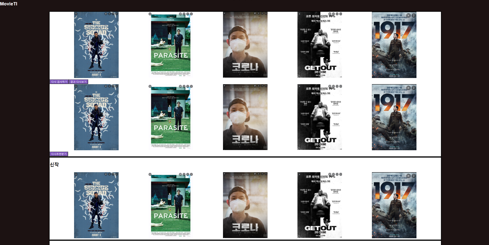
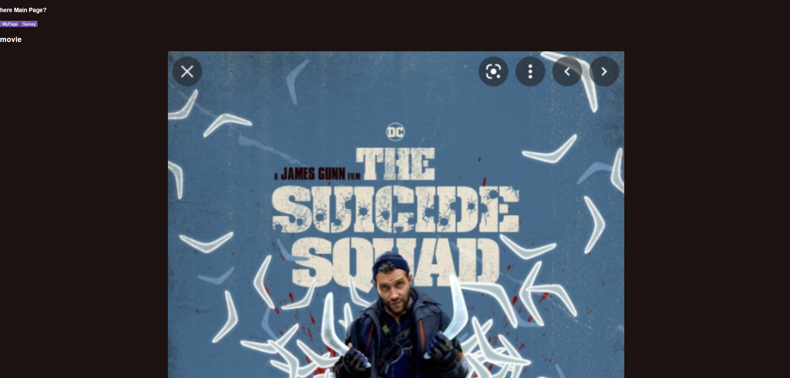
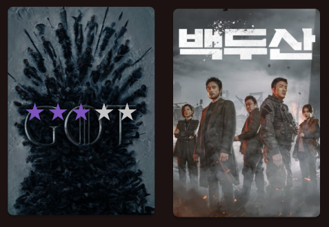
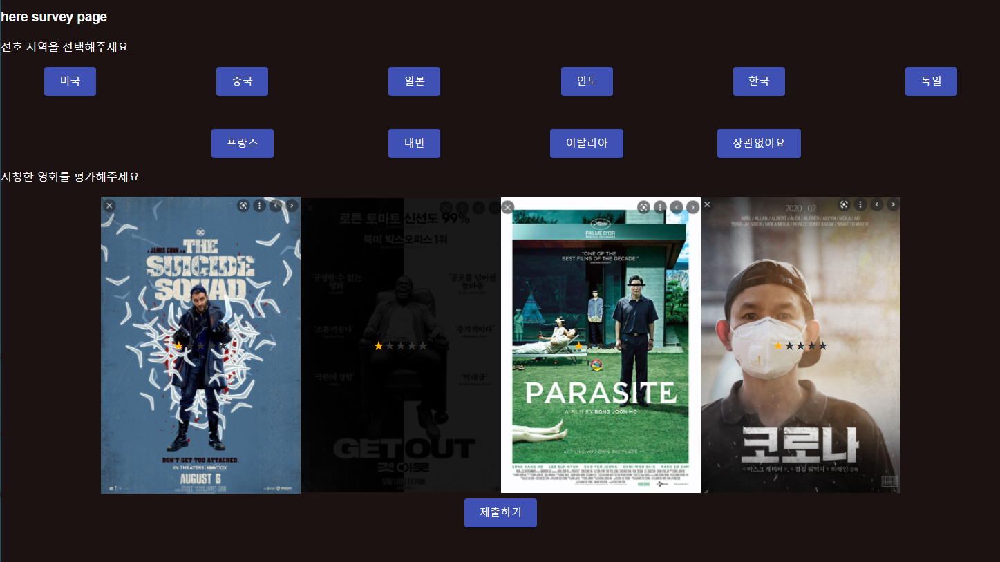

# 특화 진행상황

## 0919

캐러셀을 넣어서 메인페이지 틀만 잡아놨고 아직 디테일한 부분에서 많이 부족한 모습이 보임

케러셀이미지를 일일히 받아온것도 불편-

그래도 전역적으로 background 값하고 버튼색을 넣어준 시도는 많이 배웠음

라우터역시 잘배웠음 + 스타일드 컴포넌트 + 캐러설

지금까지 

케러셀, styled-component, ,전역으로 css 적용, 라우터를 시도해보았다.

생각보다 리액트의 css 적용방식이 불편하다!

09/20

이걸 진행해야함

그래서 마우스오버와 이벤트를 다루는 것을 공부 진행하고 착수함

그리고 별점 라이브러리를 쓰면서 클래스형 컴포넌트를 쓰는 리액트가 상당히 많다. 그래서 함수형과 클래스형의 차이를 공부했음

아직 미완성으로 진행되긴하는데 어려운 부분이다.

안에 별점에는 

https://www.npmjs.com/package/react-star-rating-component

이 라이브러리를 사용했다.!

마우스오버와 마우스아웃, 마우스 엔터를 이용해서 값을 변화시키면서 별점을 보이게 하려고했으나.

왜인지 별점의 구역을 따로 인식하면서 마우스 아웃이 일어남!?

밖의 마우스아웃 => 안의 마우스인 => 안의 마우스아웃 =>밖의 마우스인  

순으로 진행되기 떄문에 난감한상황이다. 

=> 포스터에서 별점섹션으로 가는것과 그냥 벗어나는것과 구분을 못시킴!!!

 그래서 마우스 엔터도 시도해봤으나 똑같다 ㅠㅠ 왜 섹션을 새로 인식하는 거니...

매터리어UI를 통해서 Button 과 Grid 를 사용해서 나라 버튼을 구성함! 태그에 inline으로 바로 적용시킬수있는것에 감사함!!!

이렇게 까지 구현함!

별점이 남은거는 위에 말한 문제때문에 생기는것이다 ㅠ

아 밝기를 조절하는것은 스타일 필터의 brightness를 통해 구현함!