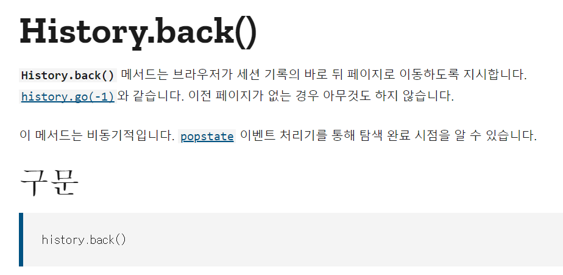
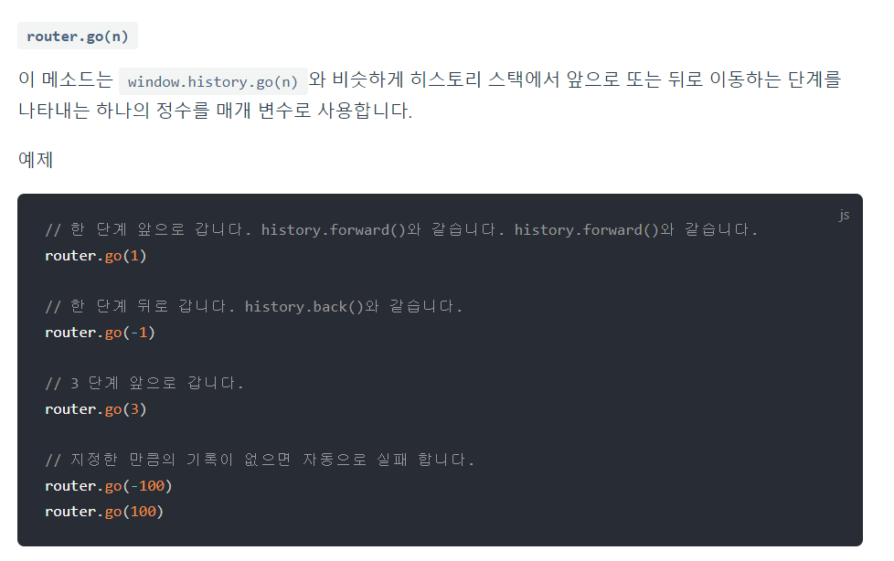
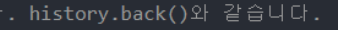

# Vue.js : 뒤로가기


## :thinking: 생각하기

뷰 프로젝트를 진행하면서  뒤로가기를 구현해하게 되었다. 어떻게 해야할까?

경험을 통해서 생각해보면 뒤로가기는 두가지로 나누어진다.


1. 전의 페이지를 보여준다.
2. 메인 페이지로 넘어간다.


- 2의 경우는 따로 뒤로가기 버튼에 대해서 경로를 설정 해주었을 것이다.

- 1의 경우는 url을 미리 저장을 해서 이를 참조하면서 전의 페이지로 돌아갈것이다. 

  ​	더생각해보면 스택을 사용해서 url을 쌓을것이고 그러면 어느정도 크기를 미리 정하고 이용할것이다.

  ​	100번 뒤로가기까지 해본적이 없으니 가정일뿐이다.

   


## :back: 뒤로가기란? 

뒤로가기에 대해서 검색결과 좋은 글을 찾았다.

https://brunch.co.kr/@uxdesingercho/1

뒤로가기는 2가지로 이루어진다.

1. History Back
2. Hierarchy Back

내가 경험했던 방식을 1,2로 나눈것처럼 방법, 역시 나누어져있었다.


'History Back' 은

​	과정그대로 뒤의 페이지로 가기 때문에 구글디자인에서 System Back 버튼이라고하며

​	stack의 형태로 정보를 관리한다. 

​	stack의 경우 데이터가 쌓이므로 순환구조로 무한히 뒤로가는 상황은 방지해야한다.


'Hierarchy Back'은 

​	상위 계층 으로 가기때문에  Up버튼으로 정의한다. 

​	(ex. 주문내역(하위)에서 홈페이지(상위계층)로 가는것)

​	tree의 계층형태로 화면을 찾아간다.

​	

**쿠팡**의 경우 뒤로가기 버튼에 History Back 적용이며 

**네이버**에는 뒤로가기버튼이 없지만 마찬가지로 History Back 이다.

Hierarchy Back 은 어디있을까 생각했는데  대표적으로 **iOS** UI가 있었다.

**안드로이드**는 두가지를 섞어서 사용! 


별거아닌 '뒤로가기' 일지라도 사용자입장에서 별거아닌것으로 느낄정도로 많이 사용하는 기능이다!

:fire: 언제나  사용자경험을 고려해야한다. :fire:


## :bookmark_tabs: Vue 에서 구현

지금 프로젝트를 사용자 경험을 생각해봤을때 

게시글의 댓글들의 사람들을 살펴보고 다시돌아오고 이런과정이 있지않을까 생각했다.

그래서 'History Back' 을 사용하기로 결정!


어떻게? 의외로 간단하게 구현할수있었다.


**history.back()** 을 사용하자(?)



​								https://developer.mozilla.org/ko/docs/Web/API/History/back

--------


- Vue에서는 SPA를 제작할 때 유용한 라우팅 라이브러리로 Vue Routers를 제공한다.

  그래서 뷰 라우터의 공식문서를 자세히 살펴보면 실마리를 찾을수있었다.

  



​							https://router.vuejs.org/kr/guide/essentials/navigation.html





#### 					       								```router.go(-1)``` 를 써주면 되겠습니다!


조금더 자세히 쓰자면

```javascript
Back(){
	this.$router.go(-1) // 이렇게 써준다.
	}
```


------------

필자는 관련 검색을 해보면서 history 모드에서만 적용 된다고 하는글을 보았다. 

필자 역시 history-mode 였기때문에  상관을 없었지만 그래도 왜 hash 모드에서는 안될까 찾아봤는데 그런글은 찾아볼 수 없었다. 

그런데 가이드에서 글을 잘 살펴보면 이런 말이있다.


음.. 되긴하는데 go(-1) 이 안되는것일까.. 의아한 부분이다.


## 후기

UI/UX는 언제든지 존재한다.

histroy mode , 해쉬뱅 등 여러가지 어려운 개념들이 연달아 나와서 진땀뺐다.


## 참고

router.go(-1) : https://router.vuejs.org/kr/guide/essentials/navigation.html

histoty.back(): https://developer.mozilla.org/ko/docs/Web/API/History/back

뒤로가기 참고 URL

​	https://brunch.co.kr/@uxdesingercho/1

​	https://www.bottlehs.com/vue/vue-js-%ED%9E%88%EC%8A%A4%ED%86%A0%EB%A6%AC-%EA%B4%80%EB%A6%AC/

