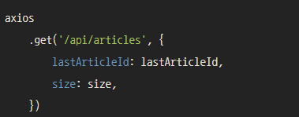
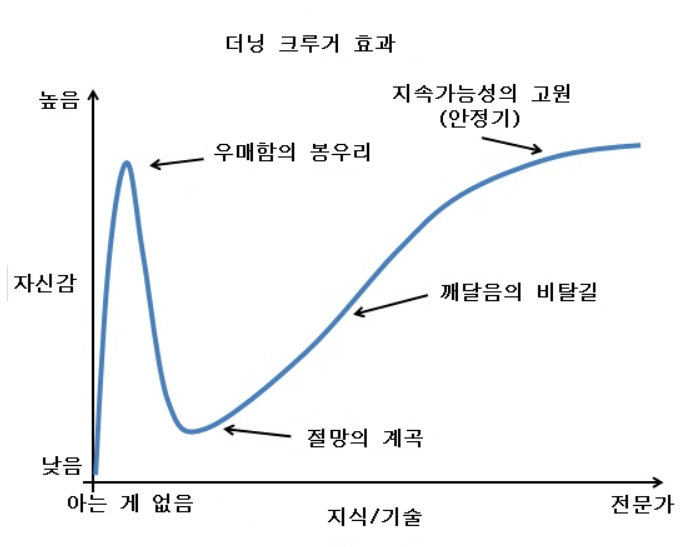

# Vue.js 무한스크롤


## :thinking: 생각하기

SNS를 이용해보았다면 스크롤을 무한히 내리면서 게시글을 본적이 있을것이다.  

개인적으로 SNS의 핵심+필수요소 중 하나라고 생각한다.

어떻게 구현할 수 있을까? 생각나는 방법은 두가지다.


1. 모든 게시글을 불러와서 부분적으로 보여준다.
2. 주어진 게시글을 다보면 다음것의 게시글을 요청한다.


1의 방법은 간단한 방법이라고 생각하지만 막상 구현하고 나면 첫페이지에 들어갈시 엄청난 양의 데이터 폭탄이 날라올것이다.  간단하지만 비효율적인 방법이다.

2의 방법은 상당히 이상적인 방법이다. 데이터의 양도 조절될것이며 사용자 입장에서 그만큼 빠른 속도로 사용할수있을 것이다. 하지만 순서나 정렬에 있어서 어려움이 있을것이다.


가능하다면 2의 방법으로 진행하는게 의미있다고 생각한다.


## :scissors: 구현하기

위의 2의 방법을 진행하기 위해서는 정확히 어떤 방식으로 해야할까?

기존에 생각한 방식 이렇다.

- 게시글 데이터에 page라는 속성을 추가

- 스크롤이 80%에 도착할 쯤 이벤트를 발동

- 해당 페이지의 값을 가진 게시글들을 요청


https://wbluke.tistory.com/18

위 링크를 통해서 내가 생각한 방식이 맞는것을 확인했다! 

코드 또한 확인해보았지만....

Spring Boot와 JPA를 기반으로한 코드였기 때문에 참고할수가 없었다. :sob:



axios 에서 저렇게 size를 사용해 원하는 만큼의 크기를 요청할수있는것 같으나 Vue에서 그런 기능을 찾진 못했다.


Vue에 한해서 구현할수있는 방법을 찾던도중 무한스크롤에 관한 라이브러리를 찾게 되었다.

https://peachscript.github.io/vue-infinite-loading/guide/start-with-hn.html

대부분 이 라이브러리를 사용하고 있었고 이를 통해 무한 스크롤을 구현했다.


## :computer: Code

**HTML**

```html
<div v-for="article in articles" :key="article.review" style="z-index:-1;">
        <p> {{ article }} </p>
</div>
<infinite-loading @infinite="infiniteHandler"></infinite-loading>
```

- 이부분은 데이터를 받은 articles를 v-for로 나열한것과, InfiniteLoading 컴포넌트를 쓴것 뿐이다.


**Script**

``` javascript
import axios from 'axios'
import InfiniteLoading from 'vue-infinite-loading';
export default {
  components: {
    InfiniteLoading,
  },
  data() {
      return {
        pageNum: 0,  // 게시글의 해당되는 페이지
        articles:[], // 게시글들이 저장되는 곳
      }
  },
  methods:{
    infiniteHandler($state) {
      axios.get('http://127.0.0.1:8080/article', {
          params: {
            pageNum: this.pageNum,
          }, // axios 요청으로 아티클을 불러오며, 원하는 페이지를 파라미터로 보낸다.
        })
        .then(res => {
          if(res.data.totalPages == this.pageNum){
              $state.complete();	
              // 만약 페이지가 끝에 도착한다면 infiniteHandler의 작업을 끝냅니다.
          }else{
              setTimeout(() => {
                  const data = res.data.content;
                            for(let key in data){
                                this.articles.push(data[key])
                                //articles에 데이터 차곡차곡 넣기
                            }
                  this.pageNum++;// 다음 호출에 대비해서 페이지수를 미리 증가시킵니다.
                  $state.loaded();// 데이터가 로드가 되고 대기 상태로 갑니다.
              }, 1000)
              // 1000=> 1초의 로딩시간을 줘서 부드럽게 넘기도록 합니다.
          }
      })
      .catch(err => {
          console.log(err)
          alert('에러');
      })
    }
  }
}
```

- 동작을 살펴본 추측으로 infinite-loading  은 스크롤 감지하면서 함수호출의 역할을 하는게 아닌가 싶다.


##### 백단에서 구조를 어떻게 잡아야할까? 

위의 코드를 보고 예상할 수 있다시피 PageNum 과 totalPages를 추가 해줘야 한다.


추가적으로 정렬까지 고려해보고 싶다면 아래의 링크를 참고!

http://devstory.ibksplatform.com/2020/03/spring-boot-jpa-pageable.html


## 후기

나도 라이브러리를 안쓰고 구현할수있지 않을까? 라는 생각이 들었다.  **(우매함의 봉우리)**



나름 SNS의 핵심기능을 구현한것 같아 뿌듯하다.


## 참고

- https://wbluke.tistory.com/18
- http://yoonbumtae.com/?p=2823
- https://peachscript.github.io/vue-infinite-loading/guide/start-with-hn.html
- https://dalconbox.tistory.com/269
- https://daily-life-of-bsh.tistory.com/209
- http://devstory.ibksplatform.com/2020/03/spring-boot-jpa-pageable.html