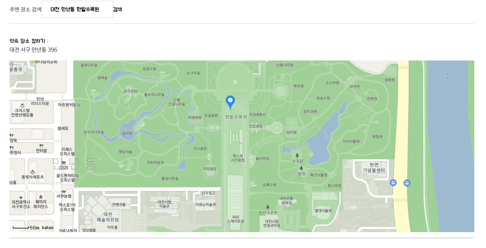

# Vue.js Kakao 지도 API 사용

약속을 잡는 프로젝트이기 때문에 약속장소는 필수적인 요소이다.

네이버, 구글, 카카오 지도 API들을 가지고 고민했었다. 

네이버가 기능적으로 많았지만 그정도로 필요하지 않고 비교적 사용하기 쉬워 보인 카카오로 정하였다.

비교 글 : https://epdev.tistory.com/8


## :thinking: 생각하기

뭐를 구현해야할까?? 

처음에는 막연히 "**위도**, **경도** 넘기면 되는거 아니야? :thinking:" 라고 생각했다.

그런데 그 막연했던 생각때문에 구현하고 나서 한계점이 확실히 보였다. :tired_face:


지나온 과정은 이렇다.

1. "위도 경도 넘기자!" :facepunch:

2. "어? 위도 경도를 가지고 주소도 보여줄 수 있네? 이거도 하자!" :facepunch:

3. "어? 중심이 서울인데 대전은 어떻게 봐야되지? 장소검색도 넣어야되네? " 


지금의 내가 예전으로 돌아간다면

카카오 API로 할수있는 기능들을 먼저 살펴보고 난 다음 

프로젝트에 적합한 기능을 선택을하고 진행 할것이다. :sweat_smile:

  

## :scissors: 구현하기


카카오 지도 API 쓰면서 놀란것이 가이드가 기능을 단계별로 쉬운거부터 어려운것을 구현할 수 있게 빌드업을 잘 해놓았다는 것이다.  


만약 카카오 지도 API 를 쓴다면 

자기가 쓰고자 하는 기능을 가진 라이브러리를 먼저 찾아보고 

그 라이브러리의 하위 요소들을 구현하는 가이드를 보고 코드를 쌓아가면, 나중에 수정이나 코드 파악이 쉬울 것이다.

(라이브러리 무작정 따라서 해보면 누구같이 머리 깨진다)  


가이드가 **자바스크립트**로 이루어져있기 때문에 **Vue.js** 를 쓰는 입장에서는 코드를 알맞게 바꿔줘야 한다!


### 1. API KEY 발급


[카카오 개발자사이트](https://developers.kakao.com)에서 카카오 로그인 후, 상단 탭 속 "내 애플리케이션" 클릭

"애플리케이션 추가하기"를 클릭 후, 적당한 이미지와 앱이름, 사업자명 작성 후 저장

	- Web 으로 선택 후, 도메인은 "http://localhost:8080"으로 적어도 무방

생성된 애플리케이션 선택하면 상단에 나오는 JavaScript 키 확인(복사)


Frontend 폴더 속 (== root)에 `.env.local` 파일 생성

	- `.gitignore` 로 git 관리 대상이 아님을 확인

- `VUE_APP_MAP_API` 라는 이름으로 이전에 복사해둔 키 값 관리하기


예시)

```
VUE_APP_MAP_API="assadasdetbaefgaefgaefb"
```

※ 나중에 다른 환경변수 추가 시 변수 이름 앞에 `VUE_APP` 을 붙여야 인식됨

※ 환경변수 생성 및 수정할 경우 서버를 재구동 해야 정상적으로 인식 됨


### 2. mounted()  속 Script 불러오기


지도를 보여주고자 하는 vue 파일 속 mounted() 에 작성

(가장 먼저 script 가 불러와야 오류가 안나기 때문)

```vue
mounted() {
  if (window.kakao && window.kakao.maps) {
    this.initMap();
  } else {
    const script = document.createElement('script')
    /* global kakao */
    script.onload = () => kakao.maps.load(this.initMap)
    script.src =
      `http://dapi.kakao.com/v2/maps/sdk.js?autoload=false&appkey=${process.env.VUE_APP_MAP_API}`
    document.head.appendChild(script)
  }
}
```


### 3. 지도 나타내기 methods 부분


`<template>` 속 지도를 표시할 부분에 다음의 태그 구문을 작성한다.

(padding-bottom: 56.25% 를 준 이유는 지도를 16:9 비율로 고정하기 위함 - 선택요소)

```html
<div v-else id="map" style="padding-bottom: 56.25%; width: 100%; height: 100%;">
```


하단의 `<script>` 부분에는 다음과 같이 작성한다.

```vue
methods: {
  initMap() {
    var mapContainer = document.getElementById('map'), // 지도를 표시할 div
        mapOption = {
          center: new kakao.maps.LatLng(37.564343, 126.947613), // 지도의 중심좌표
          level: 3, // 지도의 확대 레벨
        }

    var map = new kakao.maps.Map(mapContainer, mapOption)
  }
}
```


이렇게 되면 해당 좌표(위도(lat), 경도(lon)) 를 중심으로 하는 지도가 그려진다.


+ 클릭한 위치에 마커 표시하기

  https://apis.map.kakao.com/web/sample/addMapClickEventWithMarker/


### 4. "어? 위도 경도를 가지고 주소도 보여줄 수 있네? 이거도 하자!" 

좌표로 주소 얻어내기: https://apis.map.kakao.com/web/sample/coord2addr/


이 과정에서 문제를 많이 겪었다. 

함수안에서 선언한 함수를 `this` 붙여서 선언을 했는데 인식을 하지 않는다.


하다하다 안되서 결국 찾아낸 방법이 불러오는 함수를 아예 합쳐버리는 방법으로 했다.

(추가로 코치님에게 헬프콜 외쳤지만 해결하지 못했다.)


```javascript
<script src="https://developers.kakao.com/sdk/js/kakao.js"></script>
<script>
export default {
  data() {
    return{
      lat:0,
      lon:0,
    }
  },
  mounted() {
    if (window.kakao && window.kakao.maps) {
      this.initMap();
    } else {
      const script = document.createElement('script')
      script.onload = () => kakao.maps.load(this.initMap)
      script.src =
        `http://dapi.kakao.com/v2/maps/sdk.js?autoload=false&appkey=${process.env.VUE_APP_MAP_API}&libraries=services,clusterer`
      document.head.appendChild(script)
    }
    console.log(`${process.env.VUE_APP_MAP_API}`)
  },
  methods: {
    initMap() {
      var mapContainer = document.getElementById('map'), // 지도를 표시할 div
          mapOption = {
            center: new kakao.maps.LatLng(37.564343, 126.947613), // 지도의 중심좌표
            level: 3, // 지도의 확대 레벨
          }
      var map = new kakao.maps.Map(mapContainer, mapOption)
      var marker = new kakao.maps.Marker({ 
          // 지도 중심좌표에 마커를 생성합니다 
          position: map.getCenter() 
      });
      var geocoder = new kakao.maps.services.Geocoder();
      // 주소-좌표 변환 객체를 생성합니다

      marker.setMap(map); // 지도에 마커를 표시합니다
      kakao.maps.event.addListener(map, 'click', function(mouseEvent) {
        // 클릭한 위도, 경도 정보를 가져옵니다 
        var latlng = mouseEvent.latLng;
        marker.setPosition(latlng);
        marker.setMap(map);

        var message = '클릭한 위치의 위도는 ' + latlng.getLat() + ' 이고, ';
        message += '경도는 ' + latlng.getLng() + ' 입니다';
        console.log(message)

          // 함수 합치기
        geocoder.coord2Address(latlng.getLng(), latlng.getLat(), function(result, status) {
          if (status === kakao.maps.services.Status.OK) {
            var detailAddr = result[0].address.address_name;
            console.log(detailAddr)
          }   
        });
      });
    },
  },
}
</script>
```


### 5. "어? 중심이 서울이면 대전은 어떻게 보지? 장소검색을 넣어야겠네?"

키워드로 장소검색하고 목록 보여주기 : https://apis.map.kakao.com/web/sample/keywordList/


힘든데...이건 꼭 넣어야 된다.....ㅠ


당시 함수 오류 때문에 너무 힘들게 끝냈던지라 피폐해져 있었다.

그런데 바꾸려니 가이드에 함수가 엄청 있어서 이걸 다 합칠 생각에 아찔했다.


라이브러리에 있는걸 다쓰려고 하기보단 목록같은요소는 필요가 없기 때문에 필요한것만 사용하기로 했다.


주변장소를 검색할수있는 칸에 값을 받아서 지도 이동 후,

 클릭을 통해서 약속장소를 잡을 수 있게 했다. 


 완성된 모습은 이렇다.





```javascript
<script src="https://developers.kakao.com/sdk/js/kakao.js"></script>
<script>
export default {
  data() {
    return{
      lat:0,
      lon:0,
      promiseAroundPlace:" ",
      promiseDetailPlace:""
      // "kakao": false
    }
  },
  mounted() {
    if (window.kakao && window.kakao.maps) {
      this.initMap();
    } else {
      const script = document.createElement('script')
      script.onload = () => kakao.maps.load(this.initMap)
      script.src =
        `http://dapi.kakao.com/v2/maps/sdk.js?autoload=false&appkey=${process.env.VUE_APP_MAP_API}&libraries=services,clusterer`
      document.head.appendChild(script)
    }
    console.log(`${process.env.VUE_APP_MAP_API}`)
  },
  methods: {
    initMap() {
      var mapContainer = document.getElementById('map'), // 지도를 표시할 div
          mapOption = {
            center: new kakao.maps.LatLng(37.564343, 126.947613), // 지도의 중심좌표
            level: 3, // 지도의 확대 레벨
          }
      var map = new kakao.maps.Map(mapContainer, mapOption)
      var marker = new kakao.maps.Marker({ 
          // 지도 중심좌표에 마커를 생성합니다 
          position: map.getCenter() 
      });
      var geocoder = new kakao.maps.services.Geocoder();
      // 주소-좌표 변환 객체를 생성합니다

      // 장소 검색 객체를 생성합니다
      var ps = new kakao.maps.services.Places(); 
      ps.keywordSearch(this.promiseAroundPlace, function(data, status, pagination){
        if (status === kakao.maps.services.Status.OK) {
          // 검색된 장소 위치를 기준으로 지도 범위를 재설정하기위해
          // LatLngBounds 객체에 좌표를 추가합니다
          var bounds = new kakao.maps.LatLngBounds();
          for (var i=0; i<data.length; i++) {
              // 마커를 생성하고 지도에 표시합니다
              bounds.extend(new kakao.maps.LatLng(data[i].y, data[i].x));
          }       
          // 검색된 장소 위치를 기준으로 지도 범위를 재설정합니다
          map.setBounds(bounds);
        } 
      });
      marker.setMap(map); // 지도에 마커를 표시합니다
      kakao.maps.event.addListener(map, 'click', (mouseEvent) => {
        // 클릭한 위도, 경도 정보를 가져옵니다 
        var latlng = mouseEvent.latLng;
        marker.setPosition(latlng);
        marker.setMap(map);

        var message = '클릭한 위치의 위도는 ' + latlng.getLat() + ' 이고, ';
        message += '경도는 ' + latlng.getLng() + ' 입니다';
        console.log(message)

        this.lat = latlng.getLat()
        this.lon = latlng.getLng()

        geocoder.coord2Address(latlng.getLng(), latlng.getLat(), (result, status)=> {
          if (status === kakao.maps.services.Status.OK) {
            var detailAddr = result[0].address.address_name;
            console.log(detailAddr, typeof detailAddr)
            const place = document.querySelector('#place')
            place.innerText = detailAddr
            this.promiseDetailPlace = detailAddr
          }   
        });
      });
    },
  }
```


여전히 함수를 불러오질 않아서 `geocoder.coord2Address()` 의 경우 합친것을 확인 할수있을 것이다.


추가적으로 함수 안에 `this`가  먹질 않는 경우가 있는데,

 이 경우  **arrow function**을 통해서 원하는 데이터 값에 접근 할 수 있을 것이다.

ES6가 되면서 생긴 **arrow function** 을 사용하게 되면 함수안에서 `this`가 가리키는 Vue instance 인채로 변하지가 않습니다.

그냥 `function()`을 쓰게 되면 `this` 가 가리키는 것이 함수 내부이기 때문에 `data`에 접근이 안되었던 것입니다.


참고: https://medium.com/@hozacho/vuejs%EC%97%90%EC%84%9C-arrow-function%EC%9D%84-%EC%82%AC%EC%9A%A9%ED%95%B4%EC%95%BC%ED%95%98%EB%8A%94-%EC%9D%B4%EC%9C%A0-ec067c342412


## :postbox: 후기

지도 API 를 써봤는데 


## :page_with_curl: 참고

지도 API비교 글 : https://epdev.tistory.com/8

클릭한 위치에 마커 표시하기 :https://apis.map.kakao.com/web/sample/addMapClickEventWithMarker/

좌표로 주소 얻어내기: https://apis.map.kakao.com/web/sample/coord2addr/

키워드로 장소검색하고 목록 보여주기 : https://apis.map.kakao.com/web/sample/keywordList/

애로우 풩션 참고: https://medium.com/@hozacho/vuejs%EC%97%90%EC%84%9C-arrow-function%EC%9D%84-%EC%82%AC%EC%9A%A9%ED%95%B4%EC%95%BC%ED%95%98%EB%8A%94-%EC%9D%B4%EC%9C%A0-ec067c342412

