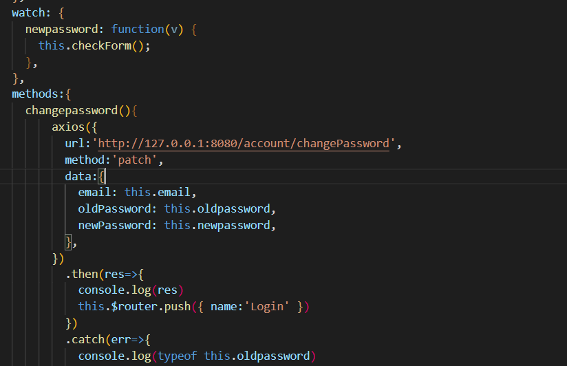
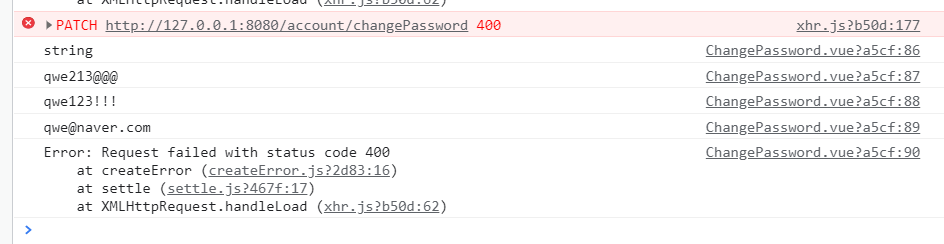
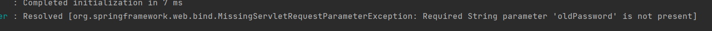
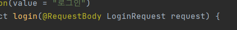

### 패스워드 변경문제

oldPassword 가넘어가지 않는 현상?

포스트맨 ok

스웨거 ok  근데 왜안됨? patch 의 문제 인가?

https://stackoverflow.com/questions/68524837/required-string-parameter-newpassword-is-not-present

- 해결

  

요구되는 형태는 param 의 형태였기 때문에 Vue에서도 data 가아닌 params 로 데이터를 보내야했습니다!.

추가적으로 프로필 변경도 해결함!

그러면 차이가 뭘까

Request 객체는 API를 컨트롤하기 위한 메소드를 셋 담고 있다.

그것이 각각

- param
- query
- body

이다

각각의 설명하자면

# **1. req.param**

주소에 포함된 변수를 담는다. 예를 들어 https://okky.com/post/12345 라는 주소가 있다면 12345를 담는다

# 2. req.query

주소 바깥, ? 이후의 변수를 담는다. 예를 들어 https://okky.com/post?q=Node.js 일 경우 Node.js를 담는다

# **3. req.body**

XML, JSON, Multi Form 등의 데이터를 담는다. 당연히 주소에선 확인할 수 없다.

