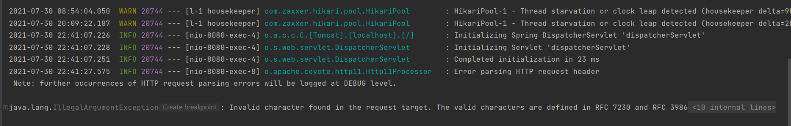
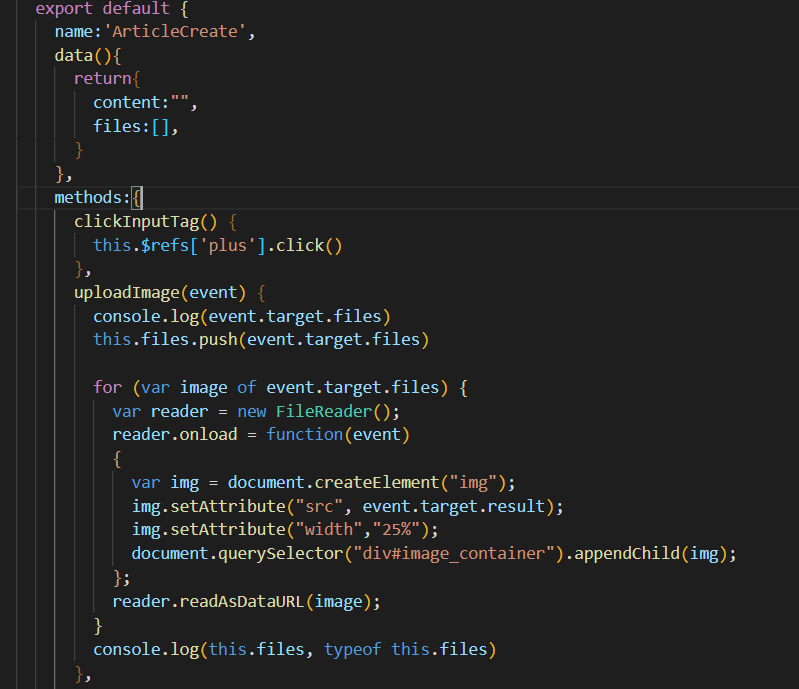

### 뒤로가기

https://brunch.co.kr/@uxdesingercho/1


# 쉬는중


created

watch

로그아웃

https://hasudoki.tistory.com/entry/Vuejs-%ED%86%A0%ED%81%B0-%EA%B8%B0%EB%B0%98-%EC%9D%B8%EC%A6%9D5-%EC%9C%A0%EC%A0%80-%EB%A1%9C%EA%B7%B8%EC%95%84%EC%9B%83


getter

https://beomy.tistory.com/85


DB구조 확인하기

DESC 테이블이름;

routes순서중요

url 이겹쳐서 안됫던 상황

웹크롤러와 웹스크롤러의 차이


https://velog.io/@pyo-sh/Spring-Boot-%ED%8C%8C%EC%9D%BC%EC%9D%B4%EB%AF%B8%EC%A7%80-%EC%97%85%EB%A1%9C%EB%93%9C-%EA%B5%AC%ED%98%84%ED%95%98%EA%B8%B0


이미지 업로드https://doogle.link/axios-%EC%82%AC%EC%9A%A9%EC%8B%9C-%ED%8F%BC-%EB%8D%B0%EC%9D%B4%ED%84%B0-%EC%A0%84%EC%86%A1%ED%95%98%EA%B8%B0-%ED%8C%8C%EC%9D%BC-%EC%97%85%EB%A1%9C%EB%93%9C/

올린 질문 :https://stackoverflow.com/questions/68592658/although-i-wrote-enctype-multipart-form-data-error-current-request-is-not-a

### 이미지 업로드







**front**

```html
<template>
  <div class="scale">
    <button><b-icon-arrow-left></b-icon-arrow-left></button><span>게시글 생성하기</span>
    <form enctype="multipart/form-data" method="post" >
      <div class="d-flex flex-row">
        <button style="display:inline-block; margin-right:5%; margin-left:2%" @click.prevent="clickInputTag()" id='addimage'><b-icon-plus class="h1"></b-icon-plus></button>
        <input hidden ref="plus" name="file" id="file" type="file"  accept="image/*" @change.prevent="uploadImage($event)" multiple>
        <div id="image_container"></div>
      </div>
      <div>
        <b-textarea v-model="content"  placeholder="Tall textarea" rows="8"></b-textarea>
        <b-button @click="articleCreate()" >전송</b-button>
      </div>
    </form>
  </div>
</template>
```


```javascript
 import axios from 'axios'
  export default {
    name:'ArticleCreate',
    data(){
      return{
        content:"",
        files: new FormData(),
      }
    },
    methods:{
      clickInputTag() {
        this.$refs['plus'].click()
      },
      uploadImage(event) { 
        console.log(event.target.files)
        const photoFile = document.getElementById("file")
        this.files.append("file", photoFile.files[0]);

        for (var image of event.target.files) {
          var reader = new FileReader(); 
          reader.onload = function(event) 
          { 
            var img = document.createElement("img"); 
            img.setAttribute("src", event.target.result); 
            img.setAttribute("width","25%"); 
            document.querySelector("div#image_container").appendChild(img); 
          }; 
          reader.readAsDataURL(image);
        } 
        console.log(this.files, typeof this.files)
      },
      articleCreate(){
        axios({
          url:'http://127.0.0.1:8080/article',
          method:'post',
          headers: {
            'x-access-token': `${localStorage.getItem('token')}`,
          },
          params: {
            content: this.content,
            files: this.files,
          }
        })
          .then(res=>{
            this.$router.push({ name:'article'})
            console.log(res.data)
            console.log(this.files)
          })
          .catch(err=>{
            console.log(`${localStorage.getItem('token')}`)
            console.log(this.files)
            console.log(this.content)
            console.log(err)
          })
      },
    }
  }
```


**back**

```java
@PostMapping("/article")
    @ApiOperation(value = "게시글 작성")
    public Object postArticle(@RequestParam String content, @RequestParam(required = true) List<MultipartFile> files) throws IOException {
        Authentication user = SecurityContextHolder.getContext().getAuthentication();
        ResponseEntity response = null;
        if(user.getPrincipal() == "anonymousUser"){
            response = new ResponseEntity<>("Fail", HttpStatus.UNAUTHORIZED);
            return response;
        }else {
            UserDetails user2 = (UserDetails) user.getPrincipal();
            Optional<User> userOpt = userDao.findByEmail(user2.getUsername());

            Long articleId = articleDao.save(Article.builder()
                    .articleid(null)
                    .id(userOpt.get().getUid())
                    .createdtime(null)
                    .updatedtime(null)
                    .review(content)
                    .build()
            ).getArticleid();

            List<String> pathName = saveFiles(files);
            System.out.println(pathName.get(0));
            for(int i = 0; i < files.size(); ++i) {
                imageDao.save(Image.builder()
                        .imageid(null)
                        .articleid(articleId)
                        .imgURL(pathName.get(i))
                        .build()
                );
            }

            response = new ResponseEntity<>("게시글 작성 완료", HttpStatus.OK);
            return response;
        }
    }
```

