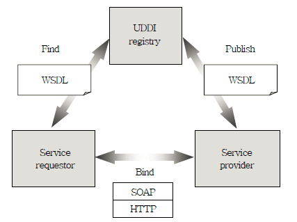

------

### XML

데이터를 나타낼수있는 방식중하나

웹브라우저간 HTML문법이 호환되지 않는 문제와 SGML의 복잡석을 해결하기 위해 

개발된 "**다목적 마크업 언어**"

구성요소

- 유니코드문자
  - 텍스트 데이터 형식
- XML 파서(Parser)
  - 해석을 위한 번역기
- 마크업과 내용
- 엘리먼트

+

XML의 느린 파싱과 보안문제로 "**JSON**" 으로 대체되고 있는 추세이다.

-----------

### JSON

데이터 포맷의 한 형태로 경량의 DATA 교환 방식이다.

- 속성-값(key-value) 쌍으로 이루어져있다.
- 비동기처리에서 쓰는 AJAX 에서 XML을 대체해서 사용하고 있다.

-------------

### SOAP (simple object access protocol)

HTTP, HTTPS, SMTP을 기반으로 해서 XML 메세지를 네트워크에서 교환하는 프로토콜

SOA(service oriented architecture) 를 따르는 웹서비스 디자인 표준

- 네트워크에서 클라이언트와 서버간 메세지 요청과 응답하는 방법 제공

**특징**

- 표준공개성
- 유연성
- 확장성
- 분산컴퓨팅
- 독립성
- 저용량 미들웨어

**웹 서비스 구성**

- WSDL(Web Services Description Language)

  웹서비스를 기술하기 위한 XML기반의 언어

- UDDI(Universal Descripton, Discovery, and Integration) 

  웹서비스의 정보를 저장과 검색을 위한 레지스트리 명세

서비스 요구자는 **UDDI**에 검색을 진행하고 

서비스 제공자는 **UDDI**에 컨텐트 등록하고

이과정을 **WSDL**를 가지고 진행 그니깐 **XML**로!

그래서 요구자는 제공자의 서비스를 이용할수있게된다.

이러한 방법이 **SOAP** 다. 라고 이해하면된다.

---------

### AJAX (asynchronous Javascript and XML)

비동기식 자바스크립트 XML

- HMTL의 한계를 넘어서 웹페이지를 구현

- 웹페이지를 새로 로딩을 안하고 객체를 자유롭게 움직일수잇따.
  - 속도가 빠르다는 장점
  - 기존의 웹서비스 경우
    - http request를 주고 HTML, CSS 를 응답받는다.
  - AJAX의 경우
    - http request를 주고 XML, JSON 만을 받는다. (지금은 JSON 으로 바뀌는 추세겟죠?)

------------

### REST (representational state transfer)

HTTP 프로토콜로 데이터를 전달하는 프레임워크

- 웹에 존재하는 미디어, db들을 고유한 **URL**에 부여해서 접근하게 한다.
- UDDI 같은 중간매체 없이 URL로 직접 전송하기 때문에 빠르다.
- 메소드
  - CRUD 역할 : GET, POST, PUT, PATCH, DELETE
- 구성요소
  - Resource : 자원 (HTTP URI)    *URL 아니다.
  - Verb : 자원에 대한 행위 (HTTP 메소드
  - Representaions : 자원에 대한 행위의 내용

------------

