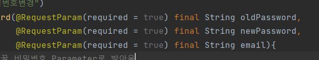

# 프로젝트 문제


### 1. 회원가입 에러500 문제


- sts

  ```java
  2021-07-23 01:32:47.084  WARN 16064 --- [io-8080-exec-10] o.h.engine.jdbc.spi.SqlExceptionHelper   : SQL Error: 1054, SQLState: 42S22
  2021-07-23 01:32:47.085 ERROR 16064 --- [io-8080-exec-10] o.h.engine.jdbc.spi.SqlExceptionHelper   : Unknown column 'user0_.create_date' in 'field list'
  2021-07-23 01:32:47.087 ERROR 16064 --- [io-8080-exec-10] o.a.c.c.C.[.[.[/].[dispatcherServlet]    : Servlet.service() for servlet [dispatcherServlet] in context with path [] threw exception [Request processing failed; nested exception is org.springframework.dao.InvalidDataAccessResourceUsageException: could not extract ResultSet; SQL [n/a]; nested exception is org.hibernate.exception.SQLGrammarException: could not extract ResultSet] with root cause
  
  java.sql.SQLSyntaxErrorException: Unknown column 'user0_.create_date' in 'field list'
  ```


해결: 데이터는 문제 없었고 깃 pull 할때 충돌일어나서 제대로 pull 되지 않아서 생긴문제


### 2. 회원가입 중복 문제

- 가입한 아이디로 로그인햇는데 안된다!

- 알고 보니 회원가입 당시 중복문제를 체크하지않아서 같은 아이디, 이메일로 가입하게됬다.

  - DB 체크

    

- 중복된 아이디로 로그인시 오류발생


### 3. 패스워드 변경문제


oldPassword 가넘어가지 않는 현상?

포스트맨 ok

스웨거 ok  근데 왜안됨? patch 의 문제 인가?

https://stackoverflow.com/questions/68524837/required-string-parameter-newpassword-is-not-present

- 해결

  



요구되는 형태는 param 의 형태였기 때문에 Vue에서도 data 가아닌 params 로 데이터를 보내야했습니다!.

추가적으로 프로필 변경도 해결함!

 스택오버플로 vs 코치님 => 코치님 승!


### 4. CSS 배경 오른쪽 여백이 생기는 현상


```css
<style scoped>
  body { padding: 0px; margin: 0px; }
  .jb-box { height: 90vh; min-width: 800px; overflow: hidden; margin: 0px auto; position: relative; }
  video { height: 100vh; }
  .jb-text { position: absolute; top: 25%; width: 50%; }
  .jb-text p {color: #ffffff; }
  .jb-text h2 { text-align: center; color: #ffffff; }
</style>
```


- 해결

  사진의 비율때문에 한곳은 무조건 비워지는 상황이다. 그러면 이미지의 크기를 더 크게해서 자르면된다.

  그거는 overflow를 이용한다.

  ```css
  <style scoped>
    template { padding: 0px; margin: 0px; }
    .jb-box {  width: 100%; overflow: hidden; margin: 0px auto; position: fixed; }
    video { height: 150vh;  overflow: hidden;  position: relative; }
    .jb-text { position: absolute; top: 25%; width: 100%; }
    .jb-text p {color: #ffffff; }
    .jb-text h2 { text-align: center; color: #ffffff; }
  </style>
  ```

  

### 5.이미지 업로드 문제


**가장 처음 코드**

```javascript
<script>
  import axios from 'axios'
  export default {
    name:'ArticleCreate',
    data(){
      return{
        content:"",
        files: File, 
      }
    },
    params(){

    },
    methods:{
      clickInputTag() {
        this.$refs['plus'].click()
      },
      uploadImage(event) { 
        console.log(event.target.files , typeof event.target.files)
        console.log(event.target.files[0] , typeof event.target.files[0])
        this.files = event.target.files[0]
        // const photoFile = document.getElementById("file")
        // this.files.append("file", photoFile.files[0]);
        // console.log(typeof photoFile.files[0] ,'파일0의 타입')
        // console.log(typeof this.files ,'파일의 타입')
        for (var image of event.target.files) {
          console.log(typeof image ,'이미지의 타입')
          var reader = new FileReader(); 
          reader.onload = function(event) 
          { 
            var img = document.createElement("img"); 
            img.setAttribute("src", event.target.result); 
            img.setAttribute("width","25%"); 
            document.querySelector("div#image_container").appendChild(img); 
          }; 
          reader.readAsDataURL(image);
        } 
        console.log(this.files, typeof this.files)
      },
      articleCreate(){
        axios({
          url:'http://127.0.0.1:8080/article',
          method:'post',
          headers: {
            'x-auth-token': `${localStorage.getItem('token')}`,
          },
          data: {
            files: this.files,
          },
          params:{
            content: this.content, 
              // 애는 따로 param인 이유는 data로 넣었는데 오류뜸! param 인 content가 없다고!
          }
        })
          .then(res=>{
            this.$router.push({ name:'article'})
            console.log(res.data)
            console.log(this.files)
          })
          .catch(err=>{
            console.log(`${localStorage.getItem('token')}`)
            console.log(this.files)
            console.log(this.content)
            console.log(err)
          })
      },
    }
  }
</script>
```


**param 으로 받음!!!**


**근데 오류!!**


```
2021-07-31 04:57:58.845 ERROR 28652 --- [io-8080-exec-10] o.a.c.c.C.[.[.[/].[dispatcherServlet]    : Servlet.service() for servlet [dispatcherServlet] in context with path [] threw exception [Request processing failed; nested exception is org.springframework.web.multipart.MultipartException: Current request is not a multipart request] with root cause

sringframework.web.multipart.MultipartException: Current request is not a multipart request
```

 **지금 리퀘스트는 멀티 파트 리퀘스트가 아니랜다!**


** 그래서 헤더에 저거 추가!**


:sob::sob::sob::sob::sob::sob::sob::sob:


뭐가 멀티 파트 request인지 확인하자

https://codingnotes.tistory.com/73


**이거 이미 햇었는데!!!**

**속는셈 치고 한번더해보자!**


:sob::sob::sob::sob::sob::sob::sob::sob:


**다시보니 content가 거슬린다. 폼태그 안에있으면 안되는것일까?**


:sob::sob::sob::sob::sob::sob::sob:


**다시 멀티파트가 뭔지 정독하자**


**비슷한오류로 찾아봣다**

**그러면 저거를 보낼때 하나의 폼데이터를 보내면 되는것인가????**


​                                                         하나의 form 데이터에 넣어서 보내준다.


​																						????


​																content 도 다시 잘 넣어 주자


:sob::sob::sob::sob::sob::sob::sob:


**문제 찾아보니**


​																	**해결책에 이런말이 있긴하다**


​																

​																	아 줜나 무한 반복인데.


이걸 content를 params 로 설정하면


content 가안먹음...........

스택 오버플로우에 투척!!

https://stackoverflow.com/questions/68592658/although-i-wrote-enctype-multipart-form-data-error-current-request-is-not-a

해결!


왜 체크 박스 안뜨냐고 !!@!@!@!@!


문제 생긴거 


1. 게시글에 2개의 파일을 넣으면 한개만 출력됨

2. ~~src 이런거 바뀌어서 detail도 손봐야함 사진같은거 안보임~~
   1. 스크랩도 아마 활성화 안되있을거임
3. 게시글을 누르면 게시글로가야되는게 어딜눌러야됨?
4. 약속게시글 도 마찬가지


5. 게시글에서 스크랩은 활성화되게 했는데 undo는 안됨 뭐지


