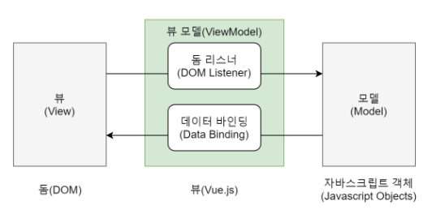

# MVC

모델 - 뷰 - 컨트롤러

- 모델 : 데이터와 비즈니스 로직을 관리합니다.
- 뷰 : 레이아웃과 화면을 처리합니다.
- 컨트롤러 : 명령을 모델과 뷰부분으로 라우팅합니다.

모델에는 데이터가 쌓이고

뷰는 데이터가 쌓인걸 보여준다.

컨트롤러는 사용자에 따라 어떤 데이터를 넣을지, 보여줄지 정하는 것이다.

Django에서는

이를 MVC 라고 하지않고 MTV 패턴이라고 한다.

Vue는 UI 화면 개발 방법 중 하나인 MVVM 패턴의 Vue 모델에 해당하는 화면단 라이브러리이다

