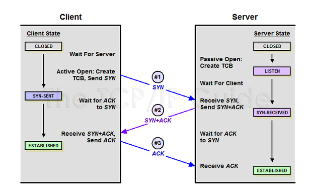
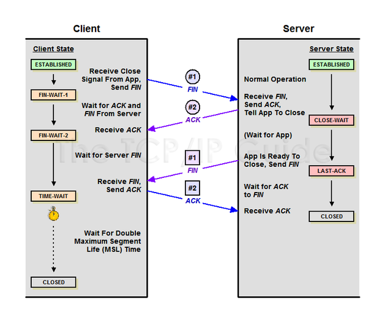

# 면접대비 프로젝트 관련 CS

- 반응형 웹페이지는 어떻게 구현?

  반응형 웹페이지의 경우 bootstrap의 레이아웃에서 breakpoints를  사용해서 구현하였습니다.

  나중에 bootstrap 없이구현하는 방법은 미디어쿼리로 스크린을 지정하고 min-width와 max-width 적절이 조절해서 해당되는 스타일값을 지정해줍니다.

- bootstrap?

   웹사이트를 쉽게 만들도록 도와주는 웹사이트 개발 프레임워크입니다.

- 프레임워크란?

  프로그래밍을 좀더 효율적이고 체계적으로 진행할수있게 구성된 소프트웨어 환경입니다.

  좀더 쉽게 말씀드리고 개발하는데 사용하는 템플릿가이드라고 볼수있습니다.

  부트스트랩은 깔끔디자인의 버튼이나 쓰기편한 레이아웃을 제공합니다.

  

- 라이브러리란?

  소프트웨어를 개발할떄 필요한 기능들을 모아놓은 소프트웨어라고 할수있습니다.

- 라이브러리 vs 프레임워크?

  주도권의 차이

  프레임워크 같은경어 주어진환경에 맞춰서 코드를 작성하지만

  라이브러리같은경우 코드를 맘껏쓰면서 라이브러리를 호출하며 사용하는 식으로 진행된다는 점에서 차이가 있습니다.

- Django란?

  파이썬으로 만들어진 무료 오픈소스 웹 프레임워크입니다. 

  - 왜 장고썻죠?
    - 당시 접했던 웹프레임 워크가 어려웠어서 복습하고자하는 마음에 선정
    - 당시 알고있는 웹프레워크가 장고밖에없었습니다. 하지만 이를 사용하고나니 좋았점은 로그인이나 CORS 같은 기본적인 라이브러리를 갖추고있기떄문에 웹을 구현하는데 있어서 도움이 컸다.

  - 장고 프레임 워크 작동방식?
    - 장고는 MTV 구조를 갖고있습니다.
    - 사용자가 URL을 입력하고 MTV V인 뷰는 받은 요청을 확인하고 모델에서 데이터를 찾습니다.
    - 찾은데이터를 뷰에게 전달하고 뷰는 템플릿에 넘기면서
    - 템플릿은 이 데이터를 조합하여서 사용자의 화면에 보여줍니다.

  

- 오픈소스란?

  공개적으로 액세스할 수 있게 설계되어 누구나 자유롭게 확인, 수정, 배포할 수 있는 코드

- 평균은 어떻게구함?

  - 쿼리셋을 불러오고 aggregate를 통해서 구현했습니다.

- 분류하는것은 어떻게 진행했나?

  사용자정의 장르분류는 values_list와 distinct() 쿼리셋을 통해서 구현했습니다.

  - 쿼리셋이란?

    - 전달받은 모델의 객체 목록. 즉 데이터베이스로부터 데이터를 읽고 필터를 걸거나 정렬할 수 있다.

    

- ORM이란?

  - 객체와 관계형 데이터베이스의 데이터를 자동으로 매핑(연결)해주는 것을 말한다.
  - SQL Query가 아닌 직관적인 코드(메서드)로 데이터를 조작할 수 있다.

- Vue 란?

  자바스크립트 기반의 프레임워크입니다. HTML의 구조를 거의 그대로 사용하기 때문에 다른 웹프레워크에 비해 러닝커브가 낮다는 장점이있습니다.

  - 자바스크립트 기반의 프레임워크?
    - 자바스크립트란 언어를 프레임워크화 해서 사용하기 편리하게 만든게 자바스크립트 프레임워크

  

- 뷰 작동방식에 대해 아나요?

  

- 왜 Vue 썻죠?

  진입장벽낮고, 비교되는 웹프레임워크인 리액트에 비해서 코드의 가시성이높다.

  코드의 섹션은 HTML, CSS, 자바스크립로 나눠져있기 떄문에 처음 협업 프로젝트를 하는 저희에게 혼선이안생기고 서로의 코드를 이해하는데 더 도움이 될것이라고 생각했습니다.

- 협업에 대해서

  - 당시 협업에대해 애기를 했는데 어떤점이 좋았나.

    3가지로 말씀드릴수있겠다.

    가장처음으로 빠르다는 점입니다. 팀원끼리하니깐 각자역할을 맡고 해야할파트를 나누다보니 프로젝트를 체계적으로 분해하고 조립하게된다. 그러다보니 진행속도가 확실히 빠르고 계획적이였다.

    두번쨰로  당시 개인프로젝트를 진행중에있었고 하나의 문제가 생기면 문제를 찾아보고, 길면 하루가지나야 답을 받을 수있었다. 그런점에서 사소한 문제라도 빠르게 피드백을 받을수있는 팀원이 있으니 작업속도 월등하게 높았따.

    세번쨰로 아이디어의 보완이 좋아았다 내가생각하지못한아이디어나 내가가진아이디어의 보완이 좋았다.

    아이디어를 좀더 탄탄하게 하는데 도움이되었다.

    개인으로 느낄수없었던, 협업을토대로한 프로젝트였다.

- UI/UX 란
  - UI
    - 유저인터페이스로 사람과 접하는 화면을 말하며
  - UX
    - 유저익스피리언스로 유저의 느낌 행동 경험을 말한다.

- osi 7계층이란

  - 통신이 일어나는 과정을 7단계로 나눈 것을 말합니다.
  - 이를 통해서 단계마다 에러나 디버깅그리고 서비스에 대해서 구분명확해진다는 장점이있습니다.

  - 물리계층, 데이터링크, 네트워크,트랜스포트,세션,표현,에플리케이션 계층으로 나누어져있다.
    - 물리 - 전기적, 기계적인 특성을 통해 데이터 전송
    - 데이터 - 정보의 전달
    - 네트  - 데이터를 목적지까지 안전하게 빠르게 전송
    - 트랜스 - 패킷생성과 전송
    - 세션 - 데이터통신을 위한 논리적인 연결
    - 표현 - 데이터의 속성구분
    - 응용 - 응용서비스를 수행 예를들어 텔넷
  - 

- TCP 란?

  서버와 클라이언트간에 데이터를 신뢰성 있게 전달하기위해 만들어진 프로토콜이다.

  데이터전송하기전에 미리 3hand shake를 통해서 연결을 구성하고 데이터를 전송하므로 신뢰성이 높다.

  싱크로 요청을보내고 싱크와에크로 답을 받고 에크를 다기보냄으로서 연결을 설정한다.

  

​		종료시에는 4hand shake를 이용한다.

​		피니쉬를 보내고 에크를 받고 연결을 끝내고 피니쉬를 받고 다시 에크로 확인을 보내준다.   

- 메모리 구조

  프로그램 운영체제로부터 할당받는 대표적인 메모리 공간은 코드,데이터,힙,스택영역으로 나누여져있습니다.

  - 코드영역
    - 실행할 프로그램의 코드가 저장되는 영역
  - 데이터 영역
    - 전역변수와 정적변수과 저장되는 영역
  - 힙영역
    - 프로그래머가 집적 공간을 할당하고 해제하는 공간
      - 말록(malloc)으로 메모리를 할당하고
      - free 로 메모리를 해제한다.
      - 선입선출 방식을 사용한다.
  - 스택영역
    - 프로그램이 자동으로 사용하는 임시메모리 영역

- 자바스크립트란?
  - 웹페이지를 좀더 동적인표현을 하기위한 프로그래밍 언어입니다.

- 모던자바스크립트란?

  - 각시대에 따라 사용되는 자바스크립트 방식다릅니다.
  - 모던자바스크립트는 15년도에나온 es6와 그이후의 판을 구현한 자바스크립트를 모던자바스크립트라고 불립니다.
  - 대표적인 변화로 예를들면 변수로서 var에서 let const 쓰게된 경우가 있구요 콜백헬을 방지하는 프로미스를 대표적으로 예를 들수있습니다.

  - let 과 const의 사용을 통해서 호이스팅을 이슈를 방지할수있습니다.